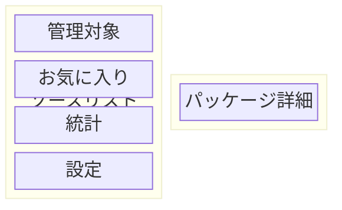
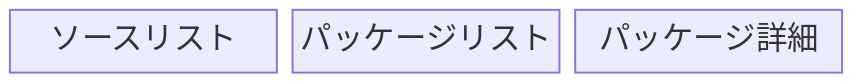

# S2J Package Dashboard - ナビゲーション仕様

## 概要

本ドキュメントは、S2J Package Dashboard の初期設計における、ナビゲーション・アーキテクチャーを定義します。

実装結果、iOS/iPadOS/Android のプラットフォーム UX、Kotlin Multiplatform のアーキテクチャー、および各関連仕様の変更に応じて、更新します。

## 目的

本ドキュメントでは、ナビゲーション・アーキテクチャー、ヒエラルキー、遷移先、経路、バック・スタック、ディープリンク、アダプティブ・ナビゲーション、およびナビゲーション状態の管理方針を定義します。

目的は、iOS/iPadOS/Android でプラットフォーム・ネイティブなナビゲーション UX を維持しながら、共通するナビゲーションのセマンティクスを一貫して提供することです。

## 非目的

本仕様では、下記を必須としません。

* iOS/Android 間でナビゲーション・コントローラを共有すること
* Compose Multiplatform (CMP) ナビゲーションを iOS に強制すること
* SwiftUI ナビゲーションを Android に移植すること
* 全ナビゲーション UI を Kotlin Multiplatform (KMP) 化すること
* ナビゲーション・スタックをクラウドに保存すること
* ナビゲーション・アナリティクスの導入
* ディープリンク、ユニバーサル・リンク、アプリリンクを、初期バージョンの最優先とすること。実装時期は [`use_cases.md` 優先順位-2](./use_cases.md#優先順位-2) の UC-27を正本とします

## 責務

ナビゲーション挙動、遷移先、経路、Back、ディープリンク意味論の正本とします。

## 非責務

横断的な UI の状態は [`ui.md`](./ui.md)、Viewport は [`ui-viewport.md`](./ui-viewport.md)、画面構成は [`screen_spec.md`](./screen_spec.md)、操作経路は [`ux_flows_spec.md`](./ux_flows_spec.md)、目的は [`use_cases.md`](./use_cases.md)、ビジュアルは [`design_spec.md`](./design_spec.md)、層とネイティブ UI は [`architecture.md`](./architecture.md)、Kotlin Multiplatform (KMP) の HOW は [`kmp_spec.md`](./kmp_spec.md)、状態の分類・復元は [`application_state.md`](./application_state.md)、検証の種類は [`testing_spec.md`](./testing_spec.md) を正本とします。

## シナリオ分担

| 問い | 正本 |
| --- | --- |
| 誰が何を達成するか | [`use_cases.md`](./use_cases.md) |
| どの状態をどの順で通るか | [`ux_flows_spec.md`](./ux_flows_spec.md) |
| その画面は何を出すか | [`screen_spec.md`](./screen_spec.md) |
| 行き先と戻り方 | 本仕様 |

## 基本方針

ナビゲーションは、下記の二層に分離します。

* ナビゲーションのセマンティクス: Kotlin Multiplatform
* ナビゲーション UI/ナビゲーション・スタック: プラットフォーム・ネイティブ

## ナビゲーション・アーキテクチャー

Kotlin Multiplatform (KMP) 共有は、遷移先セマンティクス、経路、ディープリンク定義、ナビゲーション関連ドメイン・インテントです。初期バージョンでは、プラットフォーム・アダプタが SwiftUI ナビゲーションに接続します。Android 版の開発に着手したタイミングで、Android 側は Jetpack Compose ナビゲーションに接続します。時期は [`overview.md`](./overview.md) を正本とします。

## ネイティブ・ナビゲーションの原則

初期バージョンの UI は、SwiftUI のみです。iOS/iPadOS では、SwiftUI ネイティブ・ナビゲーションを第一候補とします。

Android は、今後のターゲットです。Android 版の開発に着手したタイミングで、UI は「iOS/iPadOS: SwiftUI」と「Android: Jetpack Compose」に分けます。Android では、Jetpack Compose ネイティブ・ナビゲーションを第一候補とします。時期は [`overview.md`](./overview.md) を正本とします。

## ナビゲーション共有の原則

Kotlin Multiplatform (KMP) で共有するのは、下記とします。ナビゲーション・コントローラやナビゲーション UI 自体を共有することは必須としません。

* 遷移先の意味
* 経路データ
* ナビゲーション・インテント
* ディープリンクのセマンティクス

## ナビゲーション UI の独立性

下記は、プラットフォーム固有とします。

* NavigationStack
* NavigationSplitView
* TabView
* NavigationBar
* サイドバー
* ボトム・ナビゲーション
* Back ジェスチャ
* Back ボタン

## ナビゲーションのセマンティクス

ナビゲーション遷移先は、アプリケーション上の意味を持つ、識別子として定義します。

例:

* ダッシュボード
* PackageList
* PackageDetail
* 統計
* 設定
* About

## ナビゲーション・ヒエラルキー

基本的なナビゲーション・ヒエラルキー:

```text
S2J Package Dashboard
│
├── ダッシュボード
│
├── パッケージ
│   ├── 管理対象のパッケージ
│   ├── お気に入りのパッケージ
│   └── パッケージ詳細
│
├── 統計
│   └── パッケージ 統計
│
└── 設定
    └── About
```

## ルート遷移先

アプリケーション起動時および復元失敗時のルート遷移先は、ダッシュボードを基本とします。復元対象は [`application_state.md`](./application_state.md)、表示内容は [`screen_spec.md`](./screen_spec.md) を正本とします。

## ルート・ナビゲーション

ルート・ナビゲーションは、アプリケーション全体の主要機能へのエントリー・ポイントを提供します。

## トップレベルの遷移先

トップレベルの遷移先候補は、下記の通りです。ただし、UI 上で、常にすべての表示を必須としません。

* ダッシュボード
* パッケージ
* 統計
* 設定

## ダッシュボード

ダッシュボードは、アプリケーションのプライマリ・エントリー・ポイント / ルートのフォールバック遷移先とします。表示内容は、[`screen_spec.md`](./screen_spec.md) を正本とします。

## パッケージ・ナビゲーション

パッケージリストからパッケージを選択すると、パッケージ詳細にナビゲーションします。

表示内容は、[`screen_spec.md`](./screen_spec.md) を正本とします。

## 統計ナビゲーション

統計は、ダッシュボードまたはパッケージ詳細から、ナビゲーション可能とします。

## 設定

設定は、アプリケーション・ユーザー設定 (Preference) および、アカウント/クレデンシャル (資格情報) 関連設定へのエントリー・ポイントとします。Packagist のクレデンシャル (資格情報) 節へ進む実装時期は [`use_cases.md` 優先順位-1](./use_cases.md#優先順位-1) の UC-16を正本とします。設定画面の残りの実装時期は [`use_cases.md` 優先順位-2](./use_cases.md#優先順位-2) の UC-31を正本とします。初期バージョンの最優先ではありません。

## About

About は、設定画面から開くアプリケーション情報です。表示できることの確認は [`use_cases.md` 優先順位-2](./use_cases.md#優先順位-2) の UC-31を正本とします。表示内容は UC-32を正本とします。初期バージョンの最優先ではありません。

既存の [S2J About Window](https://github.com/stein2nd/s2j-about-window) を利用可能とします。

## ソースリスト

iPadOS 等でソースリストを利用する場合、既存の [S2J Source List](https://github.com/stein2nd/s2j-source-list) をナビゲーション・コンポーネントとして利用可能とします。

## ソースリストのセマンティクス

ソースリストのアイテムは、ナビゲーション遷移先またはナビゲーション・フィルターを表現します。

## ソースリストの例

* 管理対象
* お気に入り
* 統計
* 設定

## iPhone ナビゲーション

iPhone では、コンパクトな幅を前提とした、縦積みベースのナビゲーションを基本とします。

ダッシュボードからパッケージ詳細、パッケージ詳細から統計に進みます。

## iPhone (縦置き)

縦置きでは、単一プライマリ・コンテンツを優先します。

## iPhone (横置き)

横置きでも、コンテンツが Viewport 外に、意図せず隠れないことを保証します。

## iPad ナビゲーション

iPad では、レギュラー幅を活用したスプリット・ビュー・ナビゲーションを、優先的に検討します。

Apple ヒューマン・インターフェース・ガイドライン (HIG) でも、iPadOS ではスプリット・ビューによって、複数階層を同時に表示する構成が想定されています。

(参考: [Split views | Apple Developer Documentation](https://developer.apple.com/design/human-interface-guidelines/split-views?changes=_6))

## iPad スプリット・ビュー

基本構成:



## iPad の3カラム・ナビゲーション

必要に応じて、下図の3ペイン構成を利用可能とします。ソースリストの選択でパッケージリスト、パッケージリストの選択でパッケージ詳細を出します。



## スプリット・ビューの幅

各ペインの到達可能な最小幅は、[`ui-viewport.md`](./ui-viewport.md) を正本とします。
本仕様は、「スプリット・ビューでペインを潰して、操作不能にしない」ことのみを定めます。

## スプリット・ビューの狭い状態

ペインが狭くなりすぎる場合、無理に3ペインを維持しません。サイズクラスは、[`ui-viewport.md`](./ui-viewport.md) を正本とします。

## コンパクト・トランジション

サイズクラスは、[`ui-viewport.md`](./ui-viewport.md) を正本とします。
本仕様は、「コンパクトな幅でスプリット・ビューを、縦積みナビゲーションに折りたたむ」ことのみを定めます。

## `NavigationSplitView`

SwiftUI では、iPadOS ナビゲーションに `NavigationSplitView` を利用可能とします。

## `NavigationSplitView` 選択

スプリット・ビューでは、現在選択されているアイテムを明確に表示します。

Apple ヒューマン・インターフェース・ガイドライン (HIG) でも、スプリット・ビューでは現在の選択を、各ペインで永続的にハイライト表示することが推奨されています。

(参考: [Split views | Apple Developer Documentation](https://developer.apple.com/design/human-interface-guidelines/split-views?changes=_6))

## 選択状態

選択状態は、ナビゲーション状態として管理します。

## ナビゲーション状態

ナビゲーション状態には、最低限、下記を含めます。

* 現在の遷移先
* 選択中のパッケージ
* 選択中のソース
* ナビゲーション・パス

## ナビゲーション状態の所有権

ナビゲーション状態は、プラットフォーム・ナビゲーション層をプライマリ・オーナーとします。

## Kotlin Multiplatform (KMP) ナビゲーション状態

KMP 共有ロジックがプラットフォーム・ナビゲーション・スタック自体を所有することは、必須としません。

## ナビゲーション・パス

* iOS: `NavigationPath` 等のネイティブ・メカニズムを利用可能とする。
* Android: `NavController`、バック・スタック等を利用可能とする。

## バック・スタック

バック・スタックは、プラットフォーム・ナビゲーション・フレームワークに委譲します。

## Back ナビゲーション

Back 操作は、プラットフォーム・ネイティブ挙動を尊重します。

## iOS Back ジェスチャ

iOS では、ネイティブ Back ジェスチャを利用します。

## Android Back ジェスチャ

Android では、システム Back ジェスチャ/Back ボタンを、ネイティブ・ナビゲーションに接続します。

## Back ボタン

Back ボタンのビジュアル表現は、プラットフォーム UI に委ねます。

## Back 挙動

Back 操作は、直前のナビゲーション・コンテキストに戻ります。

## ルート Back

ルート遷移先で Back 操作した場合の、プラットフォーム固有の挙動を尊重します。

## 上に戻る

Back と上に戻るを、必要に応じて、区別します。

## ナビゲーション・スタック復元

アプリケーション再開時には、必要に応じて、ナビゲーション状態を復元可能とします。実装時期は [`use_cases.md` 優先順位-2](./use_cases.md#優先順位-2) の UC-26を正本とします。初期バージョンの最優先ではありません。

## 状態復元

状態復元では、下記を復元候補とします。

* 現在の遷移先
* 選択中のパッケージ
* ナビゲーション・パス

## 状態復元と安全性

存在しなくなったパッケージ等のナビゲーション状態を復元した場合、安全にダッシュボード等にフォールバック します。

## 削除されたパッケージ

ナビゲーション中のパッケージが、お気に入りから削除された場合でも、現在表示中のパッケージ詳細を、不必要に即座に閉じません。

## 無効な遷移先

存在しない遷移先にナビゲーションしようとした場合、「Not Found」エラー、またはフォールバック遷移先に遷移します。

## ディープリンク

ディープリンクは、初期バージョンの最優先ではありません。実装時期は [`use_cases.md` 優先順位-2](./use_cases.md#優先順位-2) の UC-27を正本とします。v1.1または v1.2など、なるべく早い時期に実装します。それまでも、外部からパッケージ識別子を渡せるナビゲーション構造とします。

## ディープリンクの原則

ディープリンクは、外部 URL を経路に変換し、遷移先に到達する構造で処理します。

## ディープリンクの例

概念:

`s2jpackagedashboard://package/vendor/package` または `https://example.com/package/vendor/package` 等を、UC-27の実装時期に利用可能とします。時期は [ディープリンク](#ディープリンク) を正本とします。

## ディープリンクの経路

ディープリンクの経路は、UI の具体的なビューではなく、セマンティックに遷移先を識別します。

## ディープリンク・パラメータ

パッケージの識別子等のリソース識別子を、経路パラメータとして利用可能とします。

## ディープリンク検証

ディープリンクから受け取った識別子は、ドメイン・ルールに従って検証します。

## ディープリンク・エラー

存在しないパッケージへのディープリンクは、「Not Found」エラー、または「ダッシュボード」等に、適切にフォールバックします。

## 外部 URL

外部 URL からアプリケーションを起動した場合、必要な遷移先までナビゲーションします。

## ユニバーサル・リンク

将来的に、iOS では、ユニバーサル・リンクを検討可能とします。

## Android アプリリンク

将来的に、Android では、アプリリンクを検討可能とします。

## ナビゲーション経路

経路は、遷移先とパラメータを表現します。

## 経路の例

概念:

* `Dashboard`
* `PackageList(filter)`
* `PackageDetail(packageIdentifier)`
* `Statistics(packageIdentifier)`
* `Settings`
* `About`

## 経路の型安全性

可能な限り、文字列のみで経路を表現しません。

## 共有の経路モデル

Kotlin Multiplatform (KMP) 共有ロジックでは、必要に応じて、直列化可能な経路モデルを定義します。

例:

* `DashboardRoute`
* `PackageListRoute`
* `PackageDetailRoute`
* `StatisticsRoute`
* `SettingsRoute`
* `AboutRoute`

## 経路と UI

経路は、具体的な UI コンポーネントを参照しません。

## 経路とドメイン

経路は、ドメイン・モデル自体をナビゲーション状態として保持しません。

## 識別子ベースのナビゲーション

パッケージ詳細へのナビゲーションでは、可能な限り、パッケージ・オブジェクト全体ではなく、下記のようにパッケージの識別子を渡します。

`PackageDetail(packageIdentifier)`

## ナビゲーション・データ

ナビゲーションに渡すデータは、最小限とします。

## 大量のナビゲーション・データ

ナビゲーション経路に大量の統計データを直接埋め込みません。

## パッケージ詳細のロード

パッケージ詳細は、識別子から必要なデータを、アプリケーション層経由で取得します。

## ナビゲーションとキャッシュ

ナビゲーション先のスクリーンは、キャッシュから既存データを取得可能とします。

## ナビゲーションとスナップショット

「統計の履歴」スクリーンは、スナップショット・リポジトリから 履歴データを取得します。

## ナビゲーションと認証

認証が必要な遷移先には、必要に応じて、認証のフローを挟みます。

## 認証のフロー

認証が必要な遷移先では、クレデンシャル (資格情報) の有無に応じて、認証を挟みます。経路は、[`ux_flows_spec.md` の認証のフロー](./ux_flows_spec.md#認証のフロー) を正本とします。
本仕様は、「保護された遷移先と復帰先」だけを定義します。

## 認証後のリターン

認証完了後、元の遷移先に復帰可能とします。

## ナビゲーション・ガード

ナビゲーション・ガードは、必要な場合のみ使用します。

## ガードの原則

ナビゲーション・ガードによって、ユーザーが意図したナビゲーションを不必要に阻害しません。

## 未保存の状態

将来的に、編集機能を追加した場合、未保存の状態を持つスクリーンには、確認を提供します。

## モーダル・ナビゲーション

シート、ダイアログ、フルスクリーン・カバーは、通常のナビゲーション・スタックとは区別します。

## シート

シートは、補助的なタスクに利用します。

例:

* お気に入りの追加
* フィルター
* ソート
* パッケージの選択

## ダイアログ

ダイアログは、短い確認またはエラー通知に利用します。

## フルスクリーンのフロー

複数ステップからなる独立したタスクでは、フルスクリーンのフローを利用可能とします。

## 認証のモーダル

認証 UI は、必要に応じて、シート/フルスクリーンとして提供可能とします。

## ナビゲーションとモーダルの境界

モーダルから通常ナビゲーション・スタックに、無秩序に遷移しません。

## タブ・ナビゲーション

複数のトップレベルの機能を、頻繁に切り替える必要がある場合、タブ・ナビゲーションを検討します。

## 初期タブ

タブ・ナビゲーションを採用する場合のプライマリ・タブは、[ルート遷移先](#ルート遷移先) を正本とします。

## iPhone タブ

iPhone では、トップレベルのナビゲーションが多い場合に、タブバーを利用可能とします。

## iPad タブ

iPad では、タブとサイドバーを、アダプティブに切り替え可能な構成を検討します。

Apple ヒューマン・インターフェース・ガイドライン (HIG) では、iPadOS のアダプティブ・サイドバー/タブ構成が、画面幅や画面回転に応じて変化できる、ナビゲーション・パターンとして示されています。

(参考: [Sidebars | Apple Developer Documentation](https://developer.apple.com/design/human-interface-guidelines/sidebars?changes=_6))

## タブ数

タブを過剰に増やしません。

## タブのセマンティクス

タブは、ナビゲーション・スタックとは異なる、独立したトップレベルのコンテキストとして扱います。

## タブのバック・スタック

タブごとに、独立したナビゲーション状態を保持可能とします。

## タブの状態復元

タブ切替後、各タブのナビゲーション状態を、可能な範囲で、維持します。

## Android ナビゲーション

Android は、今後のターゲットです。初期バージョンの UI は、SwiftUI のみです。Android 版の開発に着手したタイミングで、Jetpack Compose ナビゲーション等のネイティブ・ナビゲーション機構を利用します。時期は [`overview.md`](./overview.md) を正本とします。

## Android ナビゲーション・グラフ

Android 側では、遷移先とナビゲーション・グラフを明確に定義します。

## Android バック・スタック

Android ナビゲーションでは、ネイティブバック・スタックを利用します。

## Android ディープリンク

Android では、ディープリンク/アプリリンクとの統合を可能とします。

## iOS ナビゲーション

iOS/iPadOS では、SwiftUI ナビゲーションをネイティブ・ナビゲーション層として利用します。

## iOS ナビゲーション・スタック

iPhone では、`NavigationStack` を基本候補とします。

## iPad ナビゲーション

iPad では、`NavigationSplitView` を基本候補とします。

## ナビゲーション・コンテナ

ナビゲーション・コンテナは、スクリーン・コンテンツとは分離します。

## ナビゲーション・コーディネーター

必要に応じて、プラットフォーム固有のコーディネーターを導入します。

## コーディネーターの責務

コーディネーターは、共有経路をネイティブ・ナビゲーションに変換します。

## コーディネーターの非目標

コーディネーターに、ドメイン・ロジックを実装しません。

## 経路マッパー

プラットフォーム固有の経路マッパーを利用可能とします。共有経路を iOS/Android それぞれのナビゲーションに変換します。

## ナビゲーション・インテント

アプリケーションから UI にナビゲーション・インテントを通知する場合、セマンティックなインテントとして定義します。

例:

* `OpenPackage(packageIdentifier)`
* `OpenStatistics(packageIdentifier)`
* `OpenSettings`

## ナビゲーション・インテントの所有権

ナビゲーション・インテントの発生元は、アプリケーション/プレゼンテーション層でもよいが、実際のナビゲーション・スタック操作は、プラットフォーム UI 層が担当します。

## ナビゲーション・イベント

例:

* `onPackageSelected`
* `onStatisticsSelected`
* `onSettingsSelected`
* `onAboutSelected`

## ナビゲーション・イベントの方向

UI →プレゼンテーション→ナビゲーション・インテント→プラットフォーム・ナビゲーションを基本とします。

## ナビゲーションと ViewModel

ViewModel は、「ナビゲーション・コントローラ自体を直接操作しない」を基本とします。

## ナビゲーション・コマンド

必要に応じて、`NavigationCommand` 等の抽象イベントを利用します。

## ナビゲーション・コマンドの例

* `NavigateToPackage(packageIdentifier)`
* `NavigateToStatistics(packageIdentifier)`
* `NavigateBack`

## ナビゲーション・コマンドの実行

ナビゲーション・コマンドは、プラットフォーム・ナビゲーション・アダプタが実行します。

## 循環型ナビゲーション

ナビゲーション・グラフに、意図しない循環型ナビゲーションを作りません。

## ヒエラルキーの深さ

ナビゲーション・ヒエラルキーは、可能な限り、浅く保ちます。

## サイドバーの深さ

サイドバーに、過剰なヒエラルキーを詰め込みません。

Apple ヒューマン・インターフェース・ガイドライン (HIG) でも、原則として、サイドバーは、2階層程度までを目安とし、より深いヒエラルキーではスプリット・ビュー等を検討することが推奨されています。

(参考: [Sidebars | Apple Developer Documentation](https://developer.apple.com/design/human-interface-guidelines/sidebars?changes=_6))

## パッケージのヒエラルキー

パッケージ・ナビゲーションでは、パッケージ群→パッケージ→統計程度を基本とします。

## ナビゲーションの「パン屑リスト」

モバイル UI では、デスクトップ的な「パン屑リスト」を常用しません。

## タイトル

ナビゲーション・タイトルは、現在のコンテキストを明確にします。

## パッケージのタイトル

パッケージ詳細では、パッケージ名をナビゲーション・タイトルとして利用可能とします。

## 統計のタイトル

統計では、対象パッケージを識別できるタイトルを表示します。

## 長いタイトル

長いパッケージ名でも、ナビゲーション・バーから、意図せずコンテンツを破壊しません。

## タイトルの衝突

ツールバー/ナビゲーション・アイテムとタイトルが衝突しないようにします。

## 画面の向き

ナビゲーション・コンテナは、縦置き/横置きの変更に追従します。

## 画面の向き状態

向き変更によって、現在の遷移先を不必要にリセットしません。

## オリエンテーション・トランジション

向き変更時の中間レイアウト禁止は、[`ui-viewport.md`](./ui-viewport.md) を正本とします。
本仕様は、「向き変更で遷移先をリセットしない」ことのみを定めます。

## ナビゲーション・レイアウトの安定性

ナビゲーション・バー/サイドバー/コンテンツが、画面回転時にジャンプしないようにします。レイアウト/到達可能性の要件は、[`ui-viewport.md`](./ui-viewport.md) を正本とします。

## Viewport

到達可能性、スクロール到達、水平オーバーフロー、セーフエリアは、[`ui-viewport.md`](./ui-viewport.md) を正本とします。
本仕様は、「ナビゲーション UI の行き先と戻り方」だけを定義します。

## キーボード

物理キーボード利用時も、ナビゲーション・アクションが可能であることを考慮します。

## ポインタ (カーソル)

iPadOS/Android タブレットでは、ポインタ (カーソル) 操作を考慮します。

## アクセシビリティ

ナビゲーション要素には、適切なアクセシビリティ・ラベルを提供します。

## アクセシビリティの現在の状態

現在選択されているナビゲーション・アイテムを、アクセシビリティでも識別可能とします。

## アクセシビリティの Back

Back ナビゲーションを、アクセシビリティからも利用可能とします。

## アクセシビリティのディープリンク

ディープリンクによるナビゲーション後も、現在のコンテキストをアクセシビリティ・ツリーから理解できる構造とします。

## ローカライズ

ナビゲーション・ラベルは、ローカライズ対象とします。

## 経路の識別子

経路の識別子自体は、ローカライズしません。

## アナリティクス

ナビゲーション・アナリティクスを導入する場合、ナビゲーション・イベントを観測可能な構造とします。

## プライバシー

ナビゲーション・アナリティクスに、不要なユーザーデータを含めません。

## パッケージの識別子

ナビゲーション・イベントにパッケージの識別子を含める必要がある場合、セキュリティ/プライバシー仕様に従います。

## パフォーマンス

ナビゲーション遷移時に、不要なネットワーク・リクエストを発生させません。

## 事前読み込み

次の遷移先で必要なデータを、必要に応じて、事前読み込み可能とします。

## 事前読み込みの境界

事前読み込みは、ナビゲーション層ではなく、アプリケーション/リポジトリ層で管理します。

## 遅延ロード

「パッケージ詳細」スクリーンは、必要なデータを遅延ロード可能とします。

## ナビゲーションのキャンセル

ナビゲーション中に不要となった非同期処理は、キャンセル可能とします。

## ナビゲーション中のエラー

ナビゲーション先のデータ・ロードに失敗した場合、ナビゲーション自体を必ずキャンセルする必要はありません。

例: パッケージ詳細でロードのあと、エラー + リトライを出す。

## オフラインのナビゲーション

オフライン時でも、キャッシュに存在する遷移先には、ナビゲーション可能とします。

## オフラインのパッケージ詳細

オフライン時に表示可能なキャッシュがある場合、パッケージ詳細を表示します。

## オフラインの統計

履歴スナップショットが存在する場合、オフラインでも統計を表示可能とします。

## Stale の遷移先

Stale データを表示する場合、UI 上で適切に示します。

## ナビゲーションとリフレッシュ

ナビゲーションとリフレッシュを、独立した状態として扱います。

## ナビゲーション中のリフレッシュ

ナビゲーション中にリフレッシュが発生しても、ナビゲーション状態を、不必要にリセットしません。

## バックグラウンド更新

バックグラウンド・スナップショット更新によって、現在のナビゲーション遷移先を、不必要に変更しません。

## パッケージの削除

パッケージがリモートから削除された場合、現在表示中のパッケージ詳細について、適切なフォールバックを提供します。

## お気に入りの削除

お気に入り解除によって、パッケージ詳細を自動的に閉じません。

## 管理対象の状態変更

管理対象のパッケージの状態変化によって、ナビゲーション・スタックを自動リセットしません。

## ナビゲーション復元

アプリケーション再起動後、可能な範囲で、最後のナビゲーション・コンテキストを復元します。

## コールドスタート

コールドスタートでは、原則として、ダッシュボードを初期遷移先とします。

ただし、有効なディープリンクがある場合は、ディープリンク遷移先を優先します。

## ウォームスタート

ウォームスタートでは、プラットフォームが保持するナビゲーション状態を、可能な範囲で、利用します。

## ディープリンクの優先順位

優先順は、下記を基本とします。

1. ディープリンク
2. 復元されたナビゲーション状態
3. デフォルト・ダッシュボード

## 無効な、復元された状態

復元したナビゲーション状態が、現在のデータモデルと矛盾する場合、安全な遷移先にフォールバックします。

## ナビゲーションのテスト

ナビゲーションは、下記の状態をテストします。

* 初期
* プッシュ
* ポップ
* 置換
* ディープリンク
* 復元
* 無効経路
* オフライン
* エラー

## iOS ナビゲーション・テスト

iOS では、SwiftUI ナビゲーションの実機/シミュレーター・テストを行います。

## Android ナビゲーション・テスト

Android では、Compose ナビゲーションのテストを行います。

## Kotlin Multiplatform (KMP) 経路テスト

KMP 共有ロジックでは、経路の直列化、解析、検証をテスト可能とします。

## ディープリンク・テスト

下記をテストします。

* 有効パッケージ
* 無効パッケージ
* 不明経路
* 不正形式の識別子

## 画面の向きテスト

下記をテストします。

* 縦置き→横置き
* 横置き→縦置き

## スプリット・ビューテスト

iPad では、下記の各幅をテスト対象とします。

* コンパクト
* 中間
* レギュラー

Apple ヒューマン・インターフェース・ガイドライン (HIG) でも、iPadOS のスプリット・ビューは、ウィンドウ幅が流動的に変化することを前提として、複数の幅でナビゲーション可能であることを確認するよう求めています。

(参考: [Split views | Apple Developer Documentation](https://developer.apple.com/design/human-interface-guidelines/split-views?changes=_6))

## Viewport テスト

Viewport の確認項目は [`ui-viewport.md` Viewport テストのマトリックス](./ui-viewport.md#viewport-テストのマトリックス) / [`ui-viewport.md` Viewport 受け入れ条件](./ui-viewport.md#viewport-受け入れ条件) を正本とします。
本仕様のテストでは、「到達不能な Back / 隠れているナビゲーション・アイテムがない」ことだけを確認します。

## ナビゲーションのリグレッション検出

ナビゲーションの構造を変更した場合、主要ナビゲーションのフローをリグレッション・テストします。

## プライマリ・ナビゲーションのフロー

経路は、[`ux_flows_spec.md`](./ux_flows_spec.md) を正本とします。
本仕様のテストは、ダッシュボード→パッケージ→パッケージ詳細→統計と、そこからの Back が遷移先として到達可能であることだけを確認します。

## お気に入りのフロー

経路は、[`ux_flows_spec.md` お気に入りのパッケージのフロー](./ux_flows_spec.md#お気に入りのパッケージのフロー) を正本とします。
本仕様のテストは、ダッシュボード→お気に入り→パッケージ詳細→ Back が到達可能であることだけを確認します。

## 管理対象のフロー

経路は、[`ux_flows_spec.md` 管理対象のパッケージのフロー](./ux_flows_spec.md#管理対象のパッケージのフロー) を正本とします。
本仕様のテストは、ダッシュボード→管理対象→パッケージ詳細が到達可能であることだけを確認します。確認する時期は [`use_cases.md` 優先順位-1](./use_cases.md#優先順位-1) の UC-02を正本とします。管理対象は、タップや選択の対象とします。

## 設定のフロー

経路は、[`ux_flows_spec.md` 設定のフロー](./ux_flows_spec.md#設定のフロー) を正本とします。
本仕様のテストは、ダッシュボードから設定の Packagist のクレデンシャル (資格情報) 節へ進み、Back でダッシュボードに戻れることを確認します。確認する時期は [`use_cases.md` 優先順位-1](./use_cases.md#優先順位-1) の UC-16を正本とします。設定画面の残りへ進む確認の時期は [`use_cases.md` 優先順位-2](./use_cases.md#優先順位-2) の UC-31を正本とします。

## About のフロー

経路は、[`ux_flows_spec.md` About のフロー](./ux_flows_spec.md#about-のフロー) を正本とします。
本仕様のテストは、ダッシュボード→設定→ About → Back が到達可能であることだけを確認します。確認する時期は [`use_cases.md` 優先順位-2](./use_cases.md#優先順位-2) の UC-31を正本とします。

## ディープリンクのフロー

経路は、[`ux_flows_spec.md` ディープリンクのフロー](./ux_flows_spec.md#ディープリンクのフロー) を正本とします。
本仕様のテストは、外部リンクからパッケージ詳細に到達可能であることだけを確認します。確認する時期は [`use_cases.md` 優先順位-2](./use_cases.md#優先順位-2) の UC-27を正本とします。

## iPad ナビゲーションのフロー

iPad では、ソースリスト、パッケージリスト、パッケージ詳細の同時表示をテストします。

## iPad 画面回転のフロー

横置き↔縦置きの向き変更で、選択/遷移先/ナビゲーション状態を維持します。向き変更時のレイアウトは、[`ui-viewport.md`](./ui-viewport.md) を正本とします。

## Android Back のフロー

Android では、システム Back ジェスチャ/Back ボタンによって、期待する遷移先に戻ることを確認します。

## コンポーネント連携

ナビゲーション・コンポーネントと、[`component_spec.md`](./component_spec.md) で定義された UI コンポーネントを分離します。

## ナビゲーションとコンポーネント

ナビゲーションは、コンポーネントを直接生成する責務を持つが、コンポーネント内部にナビゲーション・ロジックを過剰に持ち込みません。

## ソースリスト連携

[S2J Source List](https://github.com/stein2nd/s2j-source-list) からナビゲーション遷移先を選択可能とします。

## ソースリスト選択

ソースリスト選択とナビゲーション遷移先を同期させます。

## 選択同期

ソース選択とナビゲーション遷移先を双方向に同期し、一貫性を維持します。

## 選択復元

ナビゲーション状態を復元した場合、ソースリストの選択も、可能な範囲で、復元します。

## 選択の無効

現在選択されているパッケージが利用できなくなった場合、適切なフォールバック選択を設定します。

## ナビゲーションと About Window

About UI は、通常のパッケージ・ナビゲーションとは異なる、アプリケーション情報のフローとして扱います。

## About プレゼンテーション

[S2J About Window](https://github.com/stein2nd/s2j-about-window) を利用する場合、プラットフォーム・ネイティブのウィンドウ/シート等のプレゼンテーションの方法に従います。

## ナビゲーションと設定

設定は、必要に応じて、階層型ナビゲーションを利用します。

## 設定の深さ

設定のナビゲーションの深さを、可能な限り、浅くします。

## ナビゲーションとデザイン

ナビゲーションのビジュアル・デザインは、[`design_spec.md`](./design_spec.md) を「信頼できる情報源 (SoT)」とします。

## ナビゲーションと UI

ナビゲーション挙動は、本仕様を正本とします。
横断的な UI の状態の表示は [`ui.md`](./ui.md)、Viewport は [`ui-viewport.md`](./ui-viewport.md) を正本とします。

## ナビゲーションとコンポーネント

ナビゲーション・コンポーネント境界は、[`component_spec.md`](./component_spec.md) と整合させます。

## ナビゲーションと Kotlin Multiplatform (KMP)

KMP 共有ナビゲーション・モデルは、[`kmp_spec.md`](./kmp_spec.md) と整合させます。

## ナビゲーションとドメイン

ナビゲーションが扱うリソース識別子は、[`models_spec.md`](./models_spec.md) と整合させます。

## ナビゲーションとセキュリティ

認証/クレデンシャル (資格情報) 関連ナビゲーションは [`authentication_spec.md`](./authentication_spec.md) および [`security_spec.md`](./security_spec.md) に従います。

## ナビゲーションとキャッシュ

オフライン/Stale ナビゲーションは、[`cache_spec.md`](./cache_spec.md) と整合させます。

## ナビゲーションとストレージ

ナビゲーション状態の永続化は、[`storage_spec.md`](./storage_spec.md) と整合させます。

## ナビゲーションと統計

統計の遷移先は、[`statistics_spec.md`](./statistics_spec.md) の 指標のセマンティクスを変更しません。

## ナビゲーション API

ナビゲーション API は、下記の概念を基本とします。

* `Destination`
* `Route`
* `NavigationIntent`
* `NavigationState`

### `Destination`

遷移先は、ユーザーが到達可能なアプリケーション・コンテキストを表現します。

### `Route`

Route は、遷移先を識別するデータを表現します。

### `NavigationIntent`

`NavigationIntent` は、「どこに移動したいか」を表現します。

### `NavigationState`

`NavigationState` は、「現在どこにいるか」を表現します。

## ナビゲーション・コントローラ

ナビゲーション・コントローラは、プラットフォーム UI 層の責務とします。

## 共有ナビゲーション・モデル

Kotlin Multiplatform (KMP) 共有ロジックでは、必要に応じて、下記のみを提供します。

* `Route`
* `Destination`
* `NavigationIntent`
* DeepLink パーサー

## プラットフォーム・アダプタ

プラットフォーム・アダプタは、共有経路をネイティブ・ナビゲーションに変換します。

## SwiftUI アダプタ

iOS/iPadOS では、Kotlin Multiplatform (KMP) 経路を SwiftUI NavigationStack / NavigationSplitView に接続します。

## Compose アダプタ

Android では、Kotlin Multiplatform (KMP) 経路を Compose ナビゲーションに接続します。

## 共有ナビゲーション・コントローラなし

iOS/Android 間でナビゲーション・コントローラを共有しません。

## UI の依存関係なし

共有ナビゲーション・モデルは、下記に依存しません。

* SwiftUI
* Compose
* UIKit
* Android SDK

## ネイティブ UX

プラットフォーム固有の、下記を尊重します。

* Back ジェスチャ
* 遷移
* ナビゲーション・バー
* タブバー
* サイドバー
* スプリット・ビュー

## iOS v26考慮事項

iOS v26では、ネイティブ SwiftUI ナビゲーションを優先的に利用します。

特にナビゲーション UI については、システムが提供する最新のビジュアル/インタラクションを利用可能な構造を維持します。

## リキッドグラス

iOS v26のリキッドグラス等のシステム・ナビゲーションの外観を、必要に応じて、ネイティブ SwiftUI ナビゲーションに委譲します。

Kotlin Multiplatform (KMP) 共有ロジックが、ナビゲーション UI 外観を制御しません。

## Android Material

Android では、Material デザイン/Android プラットフォーム UX と整合するナビゲーションを利用します。

## プラットフォーム横断型の一貫性

下記は、プラットフォーム間で統一するものです。

* 遷移先の意味
* 経路の意味
* ナビゲーションのヒエラルキー
* リソース識別子
* ディープリンクのセマンティクス

## プラットフォームの違い

下記は、プラットフォーム間で差異を許容するものです。

* ナビゲーション UI
* 遷移
* Back ジェスチャ
* サイドバー
* タブバー
* スプリット・ビュー
* ナビゲーション・バー

## ナビゲーション契約

ナビゲーション・コンポーネントは、下記の契約を満たします。

* 遷移先は、到達可能
* Back は、予測可能
* 選択は、視認可能
* 状態は、復元可能
* Viewport は、有効
* アクセシビリティは、サポート対象

## 到達不能な遷移先なし

ナビゲーション・グラフ上に存在する遷移先は、通常操作または明確なディープリンクから到達可能であること。

## 行き詰まりなし

ナビゲーションのフローが、意図せず行き詰まりになりません。

## 予測可能性

同じユーザー・アクションは、同じナビゲーションのセマンティクスを提供します。

## ナビゲーション履歴

ナビゲーション履歴は、ユーザーが期待する Back 挙動を提供できるよう管理します。

## ナビゲーション・グラフ

ダッシュボードから、管理対象/お気に入りに進みます。管理対象とお気に入りからパッケージ詳細、パッケージ詳細から統計に進みます。管理対象の取得と、Packagist のクレデンシャル (資格情報) 節へ進む実装時期は [`use_cases.md` 優先順位-1](./use_cases.md#優先順位-1) の UC-02と UC-16を正本とします。設定画面の残りへ進む実装時期は [`use_cases.md` 優先順位-2](./use_cases.md#優先順位-2) の UC-31を正本とします。About は設定画面から開き、表示できることの確認も UC-31を正本とします。初期バージョンの最優先ではありません。

## ネストしたナビゲーション

必要に応じて、機能単位で、ネストしたナビゲーションを利用可能とします。

## 機能ナビゲーション

パッケージ機能は、PackageList → PackageDetail →統計。

## ナビゲーションの分離

機能ナビゲーションは、他機能のバック・スタックを、不必要に破壊しません。

## マルチスタック

タブ・ナビゲーションを採用した場合、タブごとのナビゲーション・スタックを独立して保持可能とします。

## 縦積みリセット

タブ再選択時の縦積みリセット等は、プラットフォーム UX に従って設計します。

## ナビゲーション・パフォーマンス

ナビゲーション開始時に、不要な重い処理を、同期実行しません。

## 初期レンダリング

ナビゲーション先の初期 UI を、可能な限り、早く表示します。

## ナビゲーション後のロード

データ・ロードの見え方は、[`ui.md`](./ui.md) を正本とします。
本仕様は、「ナビゲーション完了をデータ完了まで待たない」ことのみを定めます。

## 空白ナビゲーションなし

ナビゲーション後に、意味のない真っ白なスクリーンを長時間表示しません。

## ナビゲーションの失敗

ナビゲーション自体が失敗した場合、ユーザーに明確なフォールバックを提供します。

## ナビゲーションのログ記録

デバッグ・ビルドでは、ナビゲーション・イベントをログ可能とします。

## 本番環境のログ記録

本番環境では、機密情報をナビゲーション・ログに出力しません。

## 経路のログ記録

経路パラメータに、クレデンシャル (資格情報) /Secret を含めません。

## セキュリティ境界

ナビゲーション経路に、下記を含めません。

* パスワード
* API Token
* リフレッシュ Token
* Secret

## ディープリンク・セキュリティ

外部ディープリンクのインプットを信頼しません。

## ディープリンクの検証

ディープリンク・パラメータを必ず検証してから利用します。

## URL 漏洩

クレデンシャル (資格情報) を URL に含めません。

## ナビゲーション・アナリティクスのプライバシー

ナビゲーション・アナリティクスを導入する場合、ユーザー識別子等の扱いは、プライバシー仕様に従います。

## ナビゲーション・テスト・マトリックス

検証の種類は [`testing_spec.md`](./testing_spec.md)、Viewport/基準端末は [`ui-viewport.md`](./ui-viewport.md) を正本とします。
本仕様は、「各サイズで遷移先に到達可能である」ことだけを確認します。

## 基準端末

初期リファレンス・デバイスは、[`ui-viewport.md` 基準端末](./ui-viewport.md#基準端末) を正本とします。

## 画面の向きマトリックス

向きおよびウィンドウ幅の組み合わせは、[`ui-viewport.md` Viewport テストのマトリックス](./ui-viewport.md#viewport-テストのマトリックス) を正本とします。
本仕様のテストでは、「ナビゲーションが、各サイズで到達可能である」ことだけを確認します。

## ナビゲーション・リグレッションのチェックリスト

検証の種類は [`testing_spec.md`](./testing_spec.md)、到達可能性は [`ui-viewport.md`](./ui-viewport.md)、復元対象は [`application_state.md`](./application_state.md) を正本とします。
本仕様は、「ナビゲーション変更時に、ルート/リスト/詳細/統計/Back が到達可能である」ことだけを確認します。Packagist のクレデンシャル (資格情報) 節へ進む確認の時期は [`use_cases.md` 優先順位-1](./use_cases.md#優先順位-1) の UC-16を正本とします。設定画面の残りと、設定画面から開く About の確認時期は [`use_cases.md` 優先順位-2](./use_cases.md#優先順位-2) の UC-31を正本とします。ディープリンクの確認時期は UC-27を正本とします。

## 最終的なアーキテクチャー

層とネイティブ・ナビゲーションの置き場所は、[`architecture.md`](./architecture.md) を正本とします。
本仕様の構造は、[ナビゲーション・アーキテクチャー](#ナビゲーションアーキテクチャー) を正本とします。

## 最終原則

ナビゲーションの意味は共有し、体験はプラットフォームに合わせます。共有対象 (経路/遷移先/インテント/ディープリンク意味論) と ネイティブ・スタックの置き場所は [`architecture.md`](./architecture.md) および [ナビゲーション・アーキテクチャー](#ナビゲーションアーキテクチャー) を正本とします。
