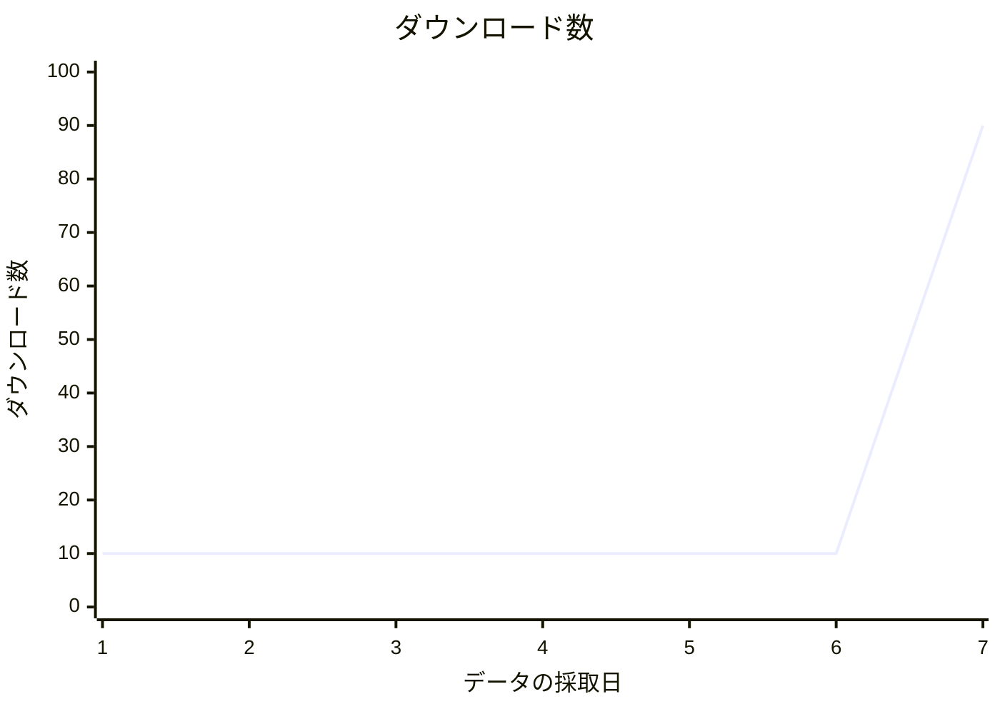
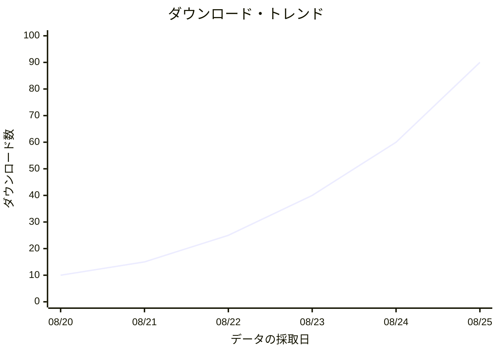

# S2J Package Dashboard - 統計/可視化の仕様

## 概要

本ドキュメントは、S2J Package Dashboard の初期設計における、統計/可視化を定義します。

Packagist/GitHub API の仕様変更、統計モデルの変更、可視化要件、iOS/iPadOS/Android 対応、Kotlin Multiplatform (KMP) 移行等に応じて、更新します。

## 目的

本ドキュメントでは、統計の収集、集計、比較および可視化の意味を定義します。Packagist/GitHub 統計、履歴 傾向、派生指標、比較、チャート、鮮度と可用性を対象とします。

## 非目的

本仕様は、API 認証のフロー、クレデンシャル (資格情報) 保存、データベース・エンジン、SwiftUI/Compose 実装、チャート・ライブラリ選択、外部サーバー、ユーザー・アカウント・システムを対象としません。

## 責務

指標の意味、収集方針、プロバイダ差、可視化の意味、スナップショットの粒度 (日次である理由) を正本とします。

## 非責務

統計の型とスキーマは [`models_spec.md`](./models_spec.md)、正しさのルールは [`domain_rules.md`](./domain_rules.md)、スナップショット永続は [`storage_spec.md`](./storage_spec.md)、キャッシュ方針は [`cache_spec.md`](./cache_spec.md)、画面の領域・構成は [`screen_spec.md`](./screen_spec.md)、到達可能性とサイズクラスは [`ui-viewport.md`](./ui-viewport.md)、ロード / リフレッシュ / 鮮度 / チャートのテキスト要約の見え方は [`ui.md`](./ui.md)、ビジュアル Token と数値書式は [`design_spec.md`](./design_spec.md)、状態分類は [`application_state.md`](./application_state.md)、API エンドポイントは各 API 仕様を正本とします。

## 基本方針

統計について、下記を基本原則とします。

1. ソースを明示する
2. 指標の意味を混同しない
3. 現在値と履歴値を分離する
4. Raw データと派生データを区別する
5. 取得不能と0を区別する
6. スナップショットを時系列データとして保持する
7. 外部 API の保持期間の制限をアプリケーション側で補完する
8. 可視化は指標の意味を正確に表現する
9. 比較可能な指標だけを比較する
10. UI 上でデータ鮮度を示す

## 統計ソース

初期バージョンでは、下記を統計ソースとします。

* Packagist
* GitHub
* 派生

## Packagist 指標

初期バージョンで扱う Packagist 指標:

* ダウンロード数: 累積/月次/日次
* Faver 数
* デペンデンツ数
* バージョン

Packagist パッケージ API では、パッケージ情報とともにダウンロード統計等を取得できます。Stats API でもダウンロード統計と Faver 数等を取得できます。

(参考: [Packagist API](https://packagist.org/apidoc))

## Packagist ダウンロード数

ダウンロード数は、累積/月次/日次を区別します。数値のみを扱わず、期間を指標 ID の一部として扱います。

## 総ダウンロード数

総ダウンロード数は、Packagist が提供する、累計ダウンロード数を表します。

* 出典 = Packagist
* name = ダウンロード数
* 期間 = total
* value

アプリケーション側で独自に累計値を算出しない。

## 月次ダウンロード数

月次ダウンロード数は、Packagist が提供する、月次ダウンロード数を表します。

「直近30日」と同義とは限らないため、UI で勝手に `Last 30 Days` と表記しません。

* 出典 = Packagist
* name = ダウンロード数
* 期間 = monthly
* value

## 日次ダウンロード数

日次ダウンロード数は、Packagist が提供する、日次ダウンロード数を表します。

履歴傾向を作成する場合は、取得時点の日次データをスナップショットとして保存します。

## Packagist Faver 数

Faver 数は、Packagist 由来の指標として扱います。

* ソース = Packagist
* 指標 = favers

GitHub スター数とは別指標とします。

Packagist の Stats API では、Faver 数が GitHub スター数と Packagist お気に入りを合わせた値として説明されているため、UI 上でも単純に GitHub スター数として表示しません。

(参考: [Packagist API](https://packagist.org/apidoc))

## デペンデンツ数

デペンデンツ数を取得可能な場合に扱います。取得できない場合は0としません。

* ソース = Packagist
* 指標 = dependents
* 単位 = count

## GitHub 指標

下記は、初期バージョンで扱う GitHub 指標です。

* スター数
* フォーク数
* 未処理 Issue 数
* 貢献者数
* コミット履歴
* トラフィック ([GitHub トラフィック](#github-トラフィック))

GitHub REST API は、リポジトリ統計としてコミット履歴、貢献者コミット履歴等を提供し、トラフィック API としてクローン数、ページビュー数、参照元数等を提供します。

(参考: [GitHub REST API](https://docs.github.com/ja/rest/metrics))

## GitHub スター数

スター数は、リポジトリの現在指標として扱います。スター数の履歴傾向を表示する場合、アプリケーション側でスナップショットを蓄積します。

* ソース = GitHub
* 指標 = stars
* 単位 = count

## GitHub フォーク数

フォーク数は、リポジトリの現在指標として扱います。

* ソース = GitHub
* 指標 = forks
* 単位 = count

## 未処理 Issue 数

未処理 Issue 数を、現在指標として扱います。将来的に、Issue の増減傾向を扱う場合は、スナップショットを利用します。

* ソース = GitHub
* 指標 = openIssues
* 単位 = count

## 貢献者数

貢献者数は、取得可能な場合に現在指標として扱います。貢献者の個人情報そのものを統計モデルに保存する必要はありません。

* ソース = GitHub
* 指標 = contributors
* 単位 = count

## コミット履歴

コミット履歴は、時系列の指標として扱います。

* period
* コミット数
* capturedAt

GitHub API が提供する週次コミット履歴や、昨年のコミット履歴を利用します。

(参考: [GitHub REST API](https://docs.github.com/ja/rest/metrics))

## コミット履歴の保持

GitHub が長期間のコミット履歴を提供する場合、そのデータをそのまま履歴スナップショットに複製する必要はありません。

一方、アプリケーション側で独自の長期傾向を構築する必要がある指標については、スナップショットを保存します。

## GitHub トラフィック

GitHub トラフィックでは、下記を扱います。

* クローン数: 計数 / ユニーク
* ビュー数: 計数 / ユニーク
* 参照元数
* 人気のコンテンツ

GitHub トラフィック API は、クローン数およびページビュー数について、直近14日の期間合計 (`count` / `uniques`) と、日次または週次の内訳を返します。期間合計を累積とは呼びません。`count` の内訳だけが単純足し算と一致します。`uniques` は単純足し算しません。レスポンスの形は [`api-github.md`](./api-github.md) を正本とします。

(参考: [リポジトリ トラフィック用 REST API エンドポイント - GitHubドキュメント](https://docs.github.com/ja/rest/metrics/traffic))

## トラフィックの保持期間

GitHub トラフィックは、長期過去データの「信頼できる情報源 (SoT)」として使用しません。

GitHub が提供するトラフィック・データは、直近14日間を対象とします。

(参考: [Viewing traffic to a repository - GitHub Docs](https://docs.github.com/en/repositories/viewing-activity-and-data-for-your-repository/viewing-traffic-to-a-repository?apiVersion=2022-11-28))

したがって、14日を超える傾向は、S2J 側スナップショットから組み立てます。組み立て HOW は [`api-github.md`](./api-github.md) の「長期統計」を正本とします。

## トラフィック権限

取得に必要な権限は [`api-github.md` Token スコープ](./api-github.md#token-スコープ) / [`api-github.md` エンドポイントの概要](./api-github.md#エンドポイントの概要) を正本とします。
本仕様は、「取得不能を `NotAuthorized` とし `0` と扱わない」ことのみを定めます。

## 統計スナップショット

履歴統計は、スナップショットとして保存します。型とスキーマは [`models_spec.md`](./models_spec.md)、不変条件は [`domain_rules.md`](./domain_rules.md)、永続化は [`storage_spec.md`](./storage_spec.md) を正本とします。
本仕様では、「日次である理由と収集・可視化上の意味」のみを定義します。

## スナップショットの粒度

可視化と時系列比較の基本単位は、日次とします。同一日の複数取得や欠測の扱いは [`domain_rules.md`](./domain_rules.md) を正本とします。

## 指標の可用性

可用性の値と0の区別は [`domain_rules.md`](./domain_rules.md) を正本とします。
可視化では、利用不能を0として描きません。

## 部分スナップショット

Packagist 取得には成功したが、GitHub 取得に失敗するケースを許容します。プロバイダ単位の可用性は [`domain_rules.md`](./domain_rules.md) を正本とします。
可視化では、取得できた側だけを描き、欠測側を0で埋めません。

## 鮮度

鮮度の状態 (新鮮 / Stale / 利用不能) と有効期限 (TTL) は [`cache_spec.md`](./cache_spec.md) を正本とします。
本仕様は、「鮮度判定が指標ごとに異なり得る」ことのみを定めます。

## 鮮度の方針

フェッチ失敗時に既存キャッシュを「Stale」として使うことは [`cache_spec.md`](./cache_spec.md) を正本とします。
古いデータを出すときの取得日時の表示は [`ui.md`](./ui.md) を正本とします。

## 現在の統計

現在値と履歴値の分離は、[基本方針](#基本方針) を正本とします。
指標の意味は [Packagist 指標](#packagist-指標) / [GitHub 指標](#github-指標) を正本とします。
パッケージ詳細上の置き場所は [`screen_spec.md`](./screen_spec.md) を正本とします。

## 統計ダッシュボード

複数パッケージの主要指標を比較可能とします。画面上の置き場所は [`screen_spec.md`](./screen_spec.md) を正本とします。
比較対象は [パッケージの比較](#パッケージの比較) を正本とします。

## パッケージの比較

下記は、比較可能な指標です。

* ダウンロード数
* スター数
* フォーク数
* Faver 数
* デペンデンツ数

比較対象の指標は「同一の期間/単位」にそろえます。

例:

| パッケージ | ダウンロード数 | スター数 | フォーク数 |
| --- | --- | --- | --- |
| package-a | 120,000 | 2,400 | 180 |
| package-b | 80,000 | 3,100 | 240 |
| package-c | 45,000 | 1,200 | 90 |

## ランキング

ランキングを提供する場合、下記のように指標を明示します。単に、「人気パッケージ」と表示して、指標をあいまいにしません。

例:

* Top ダウンロード数
* Top GitHub スター数
* Top フォーク数
* Top デペンデンツ数

## ランキングの方向

原則として、`Higher is Better` ではなく、`Descending Value` としてランキングします。

統計は必ずしも「大きいほど良い」とは限らないため、UI 上で価値を判断しません。

## 傾向

傾向は、スナップショット間の値変化として定義します。

* 傾向: `現在値 - 前回値`
* 割合の変動: `( (現在値 - 前回値) / 前回値) × 100`

ただし、「前回値」が0の場合、「割合の変動」を計算しません。

## 傾向の可用性

傾向は、最低2点のデータが必要です。

1点では傾向なし。2点以上で傾向を利用可能です。

## 成長率

成長率を表示する場合、計算期間を明示します。「成長 +12%」のように期間を省略しません。

例:

* 7-day 成長
* 30-day 成長
* 90-day 成長

## ダウンロードの成長

Packagist ダウンロード成長については、スナップショットから計算します。

例:

* 現在 = 120,000
* 前回 = 100,000
* 成長 = +20%

## 移動平均

長期傾向を平滑化する場合、移動平均を使用可能とします。Raw データと派生データは、同一系列として扱いません。

例:

* 7-day 移動平均
* 30-day 移動平均

## 移動平均の開示

移動平均を表示する場合、UI 上で明示します。単純な「ダウンロード数」として表示しません。

* ダウンロード数: 30-day 移動平均

## 正規化

異なるパッケージ間で指標を比較する場合、必要に応じて、正規化を行います。ただし、正規化済みの指標は、Raw 指標とは別指標として扱います。

例:

* ダウンロード数/日

## 率指標

率指標には、期間を含めます。「率」の定義をあいまいにしません。

* ダウンロード数/日
* コミット数/週
* スター数/月

## 派生指標

下記は、初期バージョンで検討する派生指標です。ただし、初期バージョンでは必要最小限にします。

* ダウンロード成長
* スター成長
* フォーク成長
* ダウンロード/日
* ダウンロード/スター
* リリース頻度
* コミット頻度

## ダウンロード/スター率

ダウンロード/スター率を表示する場合、「Packagist ダウンロード数 ÷ GitHub スター数」として定義します。これは人気度自体ではありません。

UI では、`ダウンロード数/Star` 等、意味が明確な名称を使用します。

## リリース頻度

リリース頻度を導入する場合、対象期間を明示します。Dev バージョン等を含めるかどうかを明確に定義します。

例:

* `リリース/90 days`

## コミット頻度

コミット頻度を導入する場合、期間と対象ブランチを明示します。GitHub API のコミット履歴の意味を、独自指標に変換する場合は、ソースと計算ルールを記録します。

例:

* `コミット数/week`

## 可視化の原則

可視化では、「見栄え」より「指標の意味の正確な表現」を優先します。

データからセマンティックな意味を経て、可視化します。

## チャート種類

初期バージョンでは、下記を使用します。必要性が確認されるまで、円チャート等は積極的に使用しません。

* 折れ線チャート
* 棒チャート
* 面チャート

## 折れ線チャート

時系列には、折れ線チャートを使用します。

適用例:

* 日次ダウンロード数
* GitHub スター数
* GitHub ビュー数
* GitHub クローン数
* コミット数

## 棒チャート

カテゴリー比較には、棒チャートを使用します。

適用例:

* パッケージ・ダウンロード数
* パッケージ スター数
* パッケージ フォーク数

## 面チャート

累積またはボリュームの変化を強調する必要がある場合に使用します。

ただし、複数指標の重なりによって、値が読みにくくならないようにします。

## 2軸

原則として、異なる単位を持つ指標を、同一チャートの2軸に配置しません。たとえば、下記を同一 Y 軸に混在させません。

* ダウンロード数
* GitHub スター数

必要な場合は、別チャートとします。

## 複数系列チャート

複数系列を表示する場合、下記を同一チャートに配置します。

* 同一の単位
* 同一の期間
* 同一のセマンティック

例:

* GitHub ビュー数
* GitHub ユニークビュー数

## 指標の比較

異なる指標を比較したい場合、必要に応じて、正規化済みの値を使用します。ただし、Raw 値を隠しません。

例:

* Relative 成長

## チャートの期間範囲

選択 UI の期間は、[`screen_spec.md`](./screen_spec.md) を正本とします。
本仕様は、「実際にデータが存在する期間だけを表示する」ことのみを定めます。

## 不十分な履歴

十分なデータポイントがない場合のドメイン状態は [`domain_rules.md`](./domain_rules.md) を正本とします。
表示文言は [`ui.md`](./ui.md) を正本とします。
本仕様は、「不足期間を0で埋めない」ことのみを定めます。

## ギャップへの対応

原則として、スナップショットが存在しない期間は、チャート上でギャップとして扱います。欠測を `0` にしないこと、ドメイン上で補間しないことは [`domain_rules.md`](./domain_rules.md) を正本とします。

```text
●──●     ●──●
      ギャップ
```

## 補間

履歴データを自動補間しないことは [`domain_rules.md`](./domain_rules.md) を正本とします。
本仕様は、「補間する場合だけ、派生指標として明示する」ことのみを定めます。

## 外れ値

外れ値を自動的に削除しません。

たとえば、下記のような急増も Raw データとして保持します。



## リリース相関

将来的に、リリースと統計を同一チャートにオーバーレイ可能とします。リリース・イベントは、統計自体とは別エンティティとして扱います。

例:


**イベント:** `2026-08-23 — v3.0 リリース`

**コメント**: 今回の StatisticsSnapshot → ChartPoint という設計を考えると、`ChartPoint(timestamp, value, label?)` の `label` をイベント表示に利用する設計はかなり自然です。

## 注釈

チャートには、必要に応じて、イベント注釈を表示します。注釈のデータソースを明示します。

例:

* v3.0.0 - リリース
* セキュリティ告知を公開
* リポジトリをアーカイブ

## チャート・インタラクション

画面上のジェスチャは [`screen_spec.md`](./screen_spec.md) を正本とします。
本仕様は、「選択したデータ・ポイントが、日付/値/ソースを開示する」ことのみを定めます。

## アクセシビリティ

色だけで伝えないことは [`ui.md`](./ui.md) を正本とします。
本仕様は、「可視化で 線種 / 記号 / ラベルを併用し得る」ことのみを定めます。

## 色の使い方

チャート色の Token は [`design_spec.md`](./design_spec.md) を正本とします。
本仕様は、「同一指標を、画面跨ぎでも、同じビジュアル符号化にする」ことのみを定めます。

## ダークモード

ライト/ダークのビジュアルは [`design_spec.md`](./design_spec.md) を正本とします。
本仕様は、「チャートが両モードで、指標を読み取れる」ことのみを定めます。

## iPhone レイアウト

画面の領域・構成は [`screen_spec.md`](./screen_spec.md)、サイズクラスは [`ui-viewport.md`](./ui-viewport.md) を正本とします。
本仕様は、「iPhone では、主要指標を縦方向に置き、チャートを無理に横長にしない」ことのみを定めます。

## iPad レイアウト

画面の領域・構成は [`screen_spec.md`](./screen_spec.md) を正本とします。
本仕様は、「iPad では、水平方向の空間を活用して、キー指標とチャートを並列し得る」ことのみを定めます。

## 横置き

向き変更時のレイアウト/到達可能性は [`ui-viewport.md`](./ui-viewport.md) を正本とします。
本仕様は、「統計チャートが向き変更後も、指標の意味を保持する」ことのみを定めます。

## チャートの画面外操作

チャート/ダッシュボードの到達可能性とオーバーフロー禁止は [`ui-viewport.md`](./ui-viewport.md) を正本とします。
本仕様は、「重要な指標やチャート操作が、画面外に残らない」ことのみを定めます。

## 水平スクロール

水平スクロールの可否と到達可能性は [`ui-viewport.md`](./ui-viewport.md) を正本とします。
本仕様は、「チャート/ダッシュボード・カード/指標グリッドを、無目的に水平スクロール・コンテナに入れない」ことのみを定めます。

## 操作領域

インタラクティブ・コントロールの最小サイズは [`ui.md`](./ui.md)、到達可能性は [`ui-viewport.md`](./ui-viewport.md) を正本とします。
本仕様は、「小さなデータ・ポイントでも、タッチエリアを拡張する」ことのみを定めます。

## 現在 vs 履歴

UI では、「現在」と「履歴」を明確に区別します。

例:

* ダウンロード数: 120,000
* 30-day 傾向: [チャート]

## データソース表示

統計カード/チャートにデータソースを出すことは、本仕様の可視化方針とします。表示文言は [`ui.md`](./ui.md) を正本とします。

## データ鮮度表示

Stale を「新鮮」に見せないことは [`cache_spec.md`](./cache_spec.md)、表示文言は [`ui.md`](./ui.md) を正本とします。
本仕様は、「統計カードで、Stale を隠さない」ことのみを定めます。

## 権限の状態表示

権限不足の表示は [`authentication_spec.md`](./authentication_spec.md) / [`ui.md`](./ui.md) を正本とします。
本仕様は、「トラフィック等を `0` にしない」ことのみを定めます。

## エラー状態

部分失敗の見え方は [`ui.md`](./ui.md) を正本とします。
本仕様は、「統計取得エラーで、ダッシュボード全体を落とさない」ことのみを定めます。

## ロードの状態

既存データがあるリフレッシュの見え方は [`ui.md`](./ui.md) を正本とします。
本仕様は、「統計カードを、毎回全面スケルトンに置換しない」ことのみを定めます。

## リフレッシュの方針

手動更新の UI は [`ui.md`](./ui.md) / [`screen_spec.md`](./screen_spec.md) を正本とします。
本仕様は、「リフレッシュを、手動/自動/バックグラウンドに区別し、GitHub トラフィック以外の初期バージョンでは手動更新を基本とする」ことのみを定めます。
GitHub トラフィックのスナップショットは、初期バージョンに含めます。取得は認証成功時に限ります。認証の設定の実装時期は [`use_cases.md` 優先順位-2](./use_cases.md#優先順位-2) の UC-17を正本とします。いつ取得するかは [`api-github.md` トラフィック・スナップショット・スケジュール](./api-github.md#トラフィックスナップショットスケジュール) を正本とします。

## 自動リフレッシュ

自動リフレッシュを導入する場合、API レート制限とバッテリー消費量を考慮します。

不要な高頻度ポーリングを行いません。

## バックグラウンド・スナップショット

GitHub トラフィックのスナップショットは、初期バージョンに含めます。取得は認証成功時に限ります。認証の設定の実装時期は [`use_cases.md` 優先順位-2](./use_cases.md#優先順位-2) の UC-17を正本とします。いつ取得するかは [`api-github.md` トラフィック・スナップショット・スケジュール](./api-github.md#トラフィックスナップショットスケジュール) を正本とします。

時計どおりの定期ジョブは、初期バージョンの対象外とします。取得に失敗しても、既存の過去データを破壊しません。

## スナップショットの保持

履歴スナップショットは、長期傾向を目的として保存します。削除期限、クォータ、集約の永続は [`storage_spec.md`](./storage_spec.md) を正本とします。

## ストレージ最適化

長期間のスナップショット増加時の集約永続は [`storage_spec.md`](./storage_spec.md) を正本とします。
本仕様は、「元データを削除する場合に、精度の損失を、指標の意味として明示する」ことのみを定めます。

## 集約

集約する場合、指標ごとに適切な集約ルールを使用します。特に独自指標は、単純加算が意味を持たない場合があります。

例:

* ダウンロード数 → Sum
* スター数 → Last Value
* フォーク数 → Last Value
* ビュー数 → Sum
* ユニークビュー数 → Do not blindly Sum

## 集約メタデータ

集約日付には、下記のルールを識別可能とします。

* 集約 = sum
* 集約 = average
* 集約 = last

## 期間境界

期間集計では、UTC を基本境界とします。

プロバイダ API が別のタイムゾーンを使用する場合、プロバイダの定義を優先します。

## Packagist/GitHub タイムゾーン

Packagist/GitHub それぞれのタイムスタンプ定義を尊重します。

GitHub トラフィックでは、タイムスタンプが UTC 深夜に調整されます。

(参考: [リポジトリ トラフィック用 REST API エンドポイント - GitHubドキュメント](https://docs.github.com/ja/rest/metrics/traffic))

アプリケーション側で現地時間に変換するのはプレゼンテーション層とする。

## 比較の期間

パッケージ比較では、下記のように、同一期間を使用します。

* パッケージ A: `30 days`
* パッケージ B: `30 days`

下記のように、期間が異なる場合には、直接比較しません。

* パッケージ A: `30 days`
* パッケージ B: `90 days`

## ランキング・データ鮮度

ランキングでは、異なる時点のデータを混在させません。

可能な限り、同じ `capturedAt` または同等の鮮度ウィンドウを使用します。

## 欠落パッケージ

パッケージが取得不能になった場合、履歴統計を削除しません。

## アーカイブ・リポジトリ

GitHub リポジトリが `Archived` になった場合も、履歴統計を保持します。

現在の状態として、`Archived` を表示可能とします。

## 削除されたリポジトリ

リポジトリが、削除/利用不能となった場合、GitHub 統計を新規取得できなくなります。

ただし、「既存スナップショット」は、保持の方針に従って保持します。

## 指標の信頼できる情報源 (SoT)

| 指標 | ソース |
| --- | --- |
| パッケージ・ダウンロード数 | Packagist |
| Packagist Faver 数 | Packagist |
| デペンデンツ数 | Packagist |
| パッケージ・バージョン | Packagist |
| GitHub スター数 | GitHub |
| GitHub フォーク数 | GitHub |
| 未処理 Issue 数 | GitHub |
| 貢献者数 | GitHub |
| コミット履歴 | GitHub |
| リポジトリ・クローン数 | GitHub |
| リポジトリ・ビュー数 | GitHub |
| 派生成長 | S2J Package Dashboard |

## 指標の命名

指標名はプロバイダ固有名称とドメイン上の意味を混同しません。

たとえば、「Packagist Faver 数」と「GitHub スター数」を、「お気に入り」という一つの指標に統合しません。

## 単位

各指標には、単位を定義します。単位を伴うビジュアル書式 (`ダウンロード数 2,478` 等) は [`design_spec.md`](./design_spec.md) を正本とします。

例:

* 数
* 割合
* 率
* 期間

## 指標定義

指標の型とフィールドは [`models_spec.md`](./models_spec.md) を正本とします。
本仕様は、「出典 / 名称 / 値 / 単位 / 期間 / capturedAt / availability を指標の意味として欠かせない」ことのみを定めます。

## Raw 指標

Raw 指標は、プロバイダから直接取得した値を表す。由来の型は [`models_spec.md`](./models_spec.md) を正本とします。

## 派生指標

派生指標は、アプリケーション側で計算した値を表す。由来 `Calculated` は [`models_spec.md`](./models_spec.md) を正本とします。
本仕様は、「計算ルールを追跡可能とする」ことのみを定めます。

## 計算バージョン

派生の計算ルール変更は追跡します。永続フィールドは [`models_spec.md`](./models_spec.md) / [`storage_spec.md`](./storage_spec.md) を正本とします。

## 統計スキーマ・バージョン

永続スキーマのバージョン は [`storage_spec.md`](./storage_spec.md) / [`models_spec.md`](./models_spec.md) を正本とします。
本仕様は、「API バージョンと混同しない」ことのみを定めます。

## 可視化モデル

ドメイン統計をそのまま UI に渡さないことは [`architecture.md`](./architecture.md) を正本とします。
本仕様は、「チャート向けにタイムスタンプ/値/ラベルに写す」ことのみを定めます。

## チャートデータ

チャートデータは UI 向け構造とします。ドメイン・モデルと UI モデルの分離は [`models_spec.md`](./models_spec.md) を正本とします。

## チャートの状態

チャート の UI の状態分類は [`ui.md`](./ui.md) / [`application_state.md`](./application_state.md) を正本とします。
本仕様は、「それらをドメイン統計モデルに含めない」ことのみを定めます。

## チャートのアクセシビリティ

テキスト要約の提供は [`ui.md`](./ui.md) を正本とします。
本仕様は、「概要が指標の意味を変えず、派生を公式値として見せない」ことのみを定めます。

## 巨大な数

コンパクト表示の見た目は [`design_spec.md`](./design_spec.md) を正本とします。
本仕様は、「コンパクトにしても詳細値を確認できる」ことのみを定めます。

## 精度

原則として、「数」は、整数です。「割合」の桁は指標ごとに定義します。

コンパクト/ロケール書式は [`design_spec.md`](./design_spec.md) を正本とします。
本仕様は、「数を小数に見せない」「割合の要求精度を、指標定義として持つ」ことのみを定めます。

## 負の値

数の非負は [`domain_rules.md`](./domain_rules.md) を正本とします。
本仕様は、「派生の違いが正負を取り得る」ことのみを定めます。

## 割合の変動

割合の変動は、`(現在値 - 前回値) / 前回値 × 100` とします。前回値が0の場合、`利用不能` とします。

## 傾向の方向

傾向のドメイン状態は [`domain_rules.md`](./domain_rules.md) を正本とします。
本仕様は、「可視化で 上昇 / 下降 / 横ばい / 利用不能 として示す」ことのみを定めます。

## 横ばい傾向

安定版判定の閾値は [`domain_rules.md`](./domain_rules.md) を正本とします。
本仕様は、「閾値なしで `変化なし` と見せない」ことのみを定めます。

## 相関

将来的に、複数指標間の相関を、提供可能とします。ただし、相関を因果関係として表示しません。

例:

* 「GitHub スター数 vs Packagist ダウンロード数」

## 因果関係の主張なし

統計可視化は、因果関係を自動的に主張しません。たとえば、下記から、`スター数が、ダウンロード数増加を引き起こした` とは判断しません。

* ダウンロード数 ↑
* スター数 ↑

## 比較の限界

初期バージョンでは、一度に比較するパッケージ数を UI が読める範囲に制限します。

特にモバイルでは、過剰な複数系列チャートを避けます。

## S2J Package Dashboard 優先順位

画面上の表示の優先順位は [`screen_spec.md`](./screen_spec.md) を正本とします。
本仕様は、「何をキー指標とするか」だけを定義します。

## キー指標

下記は、初期バージョンのキー指標候補です。リポジトリが存在する場合のみ、GitHub 指標を表示します。

* Packagist ダウンロード数
* Packagist Faver 数
* GitHub スター数
* GitHub フォーク数

## 「統計」スクリーン

画面の領域、構成、レイアウトは [`screen_spec.md`](./screen_spec.md) を正本とします。
本仕様は、「そこに載せる指標の意味」だけを定義します。

## 統計のリフレッシュ範囲

リフレッシュ操作には、範囲を持たせます。初期バージョンでは、ユーザーが意図しない大量 API リクエストを発生させません。

* パッケージのリフレッシュ
* ダッシュボードのリフレッシュ
* すべてリフレッシュ

## レート制限の理解

API レート制限を考慮します。

リクエストは、キャッシュを先に見ます。既存なら再利用、なければ API。キャッシュ方針は [`cache_spec.md`](./cache_spec.md) を正本とします。

不要な重複リクエストを避けます。

## キャッシュ・インタラクション

統計取得では、キャッシュが新鮮なら使用し、でなければフェッチを基本とします。

キャッシュ方針は [`cache_spec.md`](./cache_spec.md) で定義します。スナップショットの永続化は [`storage_spec.md`](./storage_spec.md) を正本とします。

## スナップショット・インタラクション

キャッシュとスナップショットの区別は [`cache_spec.md`](./cache_spec.md) / [`storage_spec.md`](./storage_spec.md) を正本とします。
履歴の不変条件は [`domain_rules.md`](./domain_rules.md) を正本とします。

## 履歴の訂正

既存スナップショットを書き換えない不変条件は [`domain_rules.md`](./domain_rules.md) を正本とします。
本節は、「訂正レコードの扱い」だけを定義します。

プロバイダが過去データを修正した場合でも、既存スナップショットを無条件に上書きしません。

必要な場合、下記を利用可能とします。

* originalValue
* correctedValue
* correctedAt
* reason

## 統計のエクスポート

将来的に、統計のエクスポートを提供する場合、下記を候補とします。なお、クレデンシャル (資格情報) は含めません。

* CSV
* JSON

下記は、エクスポート対象です。

* Raw スナップショット
* 派生指標
* メタデータ

## データ所有権

統計スナップショットは、S2J Package Dashboard が取得した履歴レコードです。

プロバイダ側の公式履歴データベース自体ではありません。

UI では、必要に応じて、`Collected by S2J Package Dashboard` 等の意味を明示します。

## 長期傾向の限界

長期傾向の開始日は、アプリケーションが最初にスナップショットを取得した日となります。過去データが取得できない指標について、インストール前の履歴を推測しません。

* インストール→最初のスナップショット→履歴の開始。

## 統計の可用性

扱う指標は [Packagist 指標](#packagist-指標) / [GitHub 指標](#github-指標) を正本とします。
本仕様は、「パッケージごとに利用可能な指標だけを表示し、トラフィックは [トラフィック権限](#トラフィック権限) に従う」ことのみを定めます。

## プロバイダ失敗

下記としてプロバイダ単位で表示します。

* Packagist 失敗: `Packagist 利用不能`
* GitHub 失敗: `GitHub 利用不能`

## オフライン・モード

オフライン時には、ローカル・キャッシュ/スナップショットが存在する場合、それを表示可能とします。

鮮度を明示します。

## オフライン統計

オフライン・データには、`最終更新` を表示可能とします。

オンライン・データと誤認させません。

## セキュリティ

統計データには、クレデンシャル (資格情報) を含めません。

認可済み API レスポンスから取得したデータについても、必要な統計のみを永続化に保存します。

詳細は [`security_spec.md`](./security_spec.md) を参照します。

## プライバシー

統計コレクションでは、不要な個人情報を保存しません。

たとえば GitHub トラフィックの統計取得に必要だからといって、ビジター個人を識別する情報をアプリケーションに保存しません。

## API 認証

統計取得に認証が必要な場合は、[`authentication_spec.md`](./authentication_spec.md) に従います。

統計仕様では、「認証必須」というケイパビリティだけを扱います。

## テスト

統計について最低限、下記をテストします。

* 指標マッピング
* スナップショットの作成
* スナップショットの重複排除
* 集約
* 傾向の計算
* 割合の変動
* 欠落データ
* 利用不能データ
* プロバイダの部分失敗
* キャッシュ・インタラクション
* タイムゾーン
* チャート・マッピング

## 計算テスト

下記をテストします。

```text
前回値 = 100
現在値 = 120
→ +20%

前回値 = 100
現在値 = 80
→ -20%

前回値 = 0
現在値 = 100
→ 利用不能
```

## 時系列テスト

下記をテストします。

* 連続データ
* 欠落日
* 重複日
* 順序不整合スナップショット
* タイムゾーン境界
* 閏日
* 年の境界

## 可視化テスト

向き / デバイス / 長い名称のレイアウト確認は [`ui-viewport.md`](./ui-viewport.md) を正本とします。
本節は、「指標の意味が破綻しない」ことだけをテストします。

* 小さな値
* 大きな値
* 0
* 負のデルタ
* 欠落データ
* 利用不能データ
* 多数のパッケージ
* ダークモード
* ライトモード

## Viewport テスト

Viewport の確認項目は [`ui-viewport.md` Viewport テストのマトリックス](./ui-viewport.md#viewport-テストのマトリックス) / [`ui-viewport.md` Viewport 受け入れ条件](./ui-viewport.md#viewport-受け入れ条件) を正本とします。
本仕様のテストでは、「指標の可読性とチャート操作が破綻しない」ことだけを確認します。

## 初期レイアウト

向き変更時の中間レイアウト禁止は [`ui-viewport.md`](./ui-viewport.md) を正本とします。

## アクセシビリティ

統計 UI は、ダイナミック・タイプ/フォント・スケーリングに対応可能な設計とします。重要指標が、大きいテキストで切り取られないことは [`ui-viewport.md`](./ui-viewport.md) を正本とします。

## 翻訳

指標ラベルは、翻訳対象とします。

たとえば、下記をハードコーディングされた文字列として、ドメイン・モデルに埋め込みません。

* ダウンロード数
* スター数
* フォーク数
* ビュー数
* クローン数

## 単位翻訳

数値の書式設定は、ロケールに応じて、変更可能とします。ただし、指標値自体は、ロケール非依存な数値として保持します。

## チャート翻訳

チャートの軸/ツールチップ/凡例も、翻訳対象とします。

日付フォーマットは。ユーザーのロケールに応じて、表示します。

## データモデル・リファレンス

統計の型と関係は [`models_spec.md`](./models_spec.md) を正本とします。

## アーキテクチャー・リファレンス

層の置き場所とデータ転送オブジェクト (DTO) →ドメインは [`architecture.md`](./architecture.md) / [`models_spec.md`](./models_spec.md)、永続化は [`storage_spec.md`](./storage_spec.md) を正本とします。
本仕様は、「統計の意味と可視化」だけを定めます。

## ドメイン境界

統計ドメイン・モデルは、チャート・フレームワーク (Swift チャート / Compose チャート 等) に依存しません。

## プラットフォーム UI

ネイティブ UI は [`architecture.md`](./architecture.md) を正本とします。
本仕様は、「チャートのレンダリングをプラットフォーム UI に委譲する」ことのみを定めます。

## 可視化アダプタ

必要に応じて、`StatisticsChartMapper` を設けます。ドメイン統計→チャート・モデルの層境界は [`architecture.md`](./architecture.md) / [`models_spec.md`](./models_spec.md) を正本とします。

## 初期バージョン範囲

v1で扱う指標は [Packagist 指標](#packagist-指標) / [GitHub 指標](#github-指標) を正本とします。
トラフィックの取得条件は [トラフィック権限](#トラフィック権限) を正本とします。

## v1 - 履歴範囲

過去データの粒度は [スナップショットの粒度](#スナップショットの粒度) を正本とします。
GitHub トラフィックの14日ウィンドウを超える組み立ては [`api-github.md`](./api-github.md) の「長期統計」を正本とします。
本仕様は、「v1の過去データの基本単位を、日次スナップショットとする」ことのみを定めます。

## v1 - 可視化範囲

画面の領域・構成は [`screen_spec.md`](./screen_spec.md) を正本とします。
本仕様は、「v1でリストにキー指標、詳細に現在/履歴、ダッシュボードに比較を載せる意味」だけを定めます。

## v1 - チャート範囲

使用するチャート種別は [チャート種類](#チャート種類) を正本とします。
本仕様は、「複雑な可視化を、ユーザーのニーズ確認後に追加する」ことのみを定めます。

## 将来予定の範囲

下記は、統計/可視化の将来候補です。セキュリティ告知の有無と件数は、初期バージョンのパッケージ詳細に出します。置き場所は [`screen_spec.md`](./screen_spec.md)、有無と件数は [`api-packagist.md` セキュリティ告知のユースケース](./api-packagist.md#セキュリティ告知のユースケース) を正本とします。

* セキュリティ告知の傾向
* リリース注釈
* 高度な相関
* カスタム・ダッシュボード
* カスタム指標
* パッケージ横断型ベンチマーク

エクスポートは [`use_cases.md`](./use_cases.md)、クラウド同期は [`storage_spec.md`](./storage_spec.md) を正本とします。GitHub トラフィックのスナップショットは [バックグラウンド・スナップショット](#バックグラウンドスナップショット) を正本とします。
