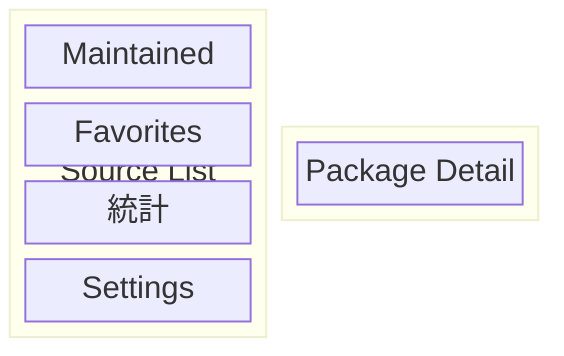
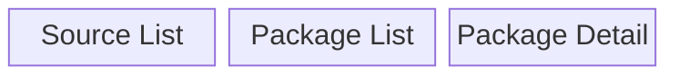

# S2J Package Dashboard - ナビゲーション仕様

## 概要

本ドキュメントは、S2J Package Dashboard の初期設計における、ナビゲーション・アーキテクチャーを定義します。

実装結果、iOS/iPadOS/Android のプラットフォーム UX、Kotlin Multiplatform のアーキテクチャー、および各関連仕様の変更に応じて更新する。

## 目的

本ドキュメントでは、ナビゲーション・アーキテクチャー、Hierarchy、Destination、Route、Back Stack、ディープリンク、アダプティブ・ナビゲーション、およびナビゲーション状態の管理方針を定義する。

目的は、iOS/iPadOS/Android でプラットフォーム Native なナビゲーション UX を維持しながら、共通するナビゲーションのセマンティクスを一貫して提供することである。

## 非目的

本仕様では下記を必須としない。

* iOS/Android 間でナビゲーション Controller を共有すること
* Compose Multiplatform ナビゲーションを iOS に強制すること
* SwiftUI ナビゲーションを Android に移植すること
* 全ナビゲーション UI を KMP 化すること
* ナビゲーション Stack を Cloud に保存すること
* ナビゲーション Analytics の導入
* ディープリンクの初期 Version での実装
* Universal Links/App Links の初期 Version での実装

## 責務

ナビゲーション挙動、Destination、Route、Back、ディープリンク意味論の正本とする。

## 非責務

横断的な UI 状態は [`ui.md`](./ui.md)、Viewport は [`ui-viewport.md`](./ui-viewport.md)、画面構成は [`screen_spec.md`](./screen_spec.md)、操作経路は [`ux_flows_spec.md`](./ux_flows_spec.md)、目的は [`use_cases.md`](./use_cases.md)、視覚は [`design_spec.md`](./design_spec.md)、層と Native UI は [`architecture.md`](./architecture.md)、KMP の HOW は [`kmp_spec.md`](./kmp_spec.md)、状態の分類・復元は [`application_state.md`](./application_state.md)、検証の種類は [`testing_spec.md`](./testing_spec.md) を正本とする。

## シナリオ分担

| 問い | 正本 |
| --- | --- |
| 誰が何を達成するか | [`use_cases.md`](./use_cases.md) |
| どの状態をどの順で通るか | [`ux_flows_spec.md`](./ux_flows_spec.md) |
| その画面は何を出すか | [`screen_spec.md`](./screen_spec.md) |
| 行き先と戻り方 | 本仕様 |

## 基本方針

ナビゲーションは下記の二層に分離する。

* ナビゲーションのセマンティクス: Kotlin Multiplatform
* ナビゲーション UI/ナビゲーション Stack: プラットフォーム Native

## ナビゲーション・アーキテクチャー

KMP 共有は Destination セマンティクス / Route / ディープリンク Definition / ナビゲーション-related ドメイン インテント。プラットフォーム Adapter が SwiftUI / Compose ナビゲーションに接続する。

## Native ナビゲーション Principle

iOS/iPadOS では、SwiftUI Native ナビゲーションを第一候補とする。

Android では、Jetpack Compose Native ナビゲーションを第一候補とする。

## ナビゲーション Sharing Principle

KMP で共有するのは、

* Destination Meaning
* Route Data
* ナビゲーション・インテント
* ディープリンクのセマンティクス

とする。

ナビゲーション Controller やナビゲーション UI そのものを共有することは必須としない。

## ナビゲーション UI Independence

下記は プラットフォーム固有 とする。

* NavigationStack
* NavigationSplitView
* TabView
* NavigationBar
* Sidebar
* Bottom ナビゲーション
* Back ジェスチャ
* Back ボタン

## ナビゲーション のセマンティクス

ナビゲーション Destination は、アプリケーション上の意味を持つ識別子として定義する。

例:

* Dashboard
* PackageList
* PackageDetail
* 統計
* Settings
* About

## ナビゲーション Hierarchy

基本的なナビゲーション Hierarchy:

```text
S2J Package Dashboard
│
├── Dashboard
│
├── Packages
│   ├── Maintained Packages
│   ├── Favorite Packages
│   └── Package Detail
│
├── Statistics
│   └── Package Statistics
│
├── Settings
│
└── About
```

## Root Destination

アプリケーション起動時および Restoration Failure 時の Root Destination は、Dashboard を基本とする。復元対象は [`application_state.md`](./application_state.md)、表示内容は [`screen_spec.md`](./screen_spec.md) を正本とする。

## Root ナビゲーション

Root ナビゲーションは、アプリケーション全体の主要 Feature への Entry Point を提供する。

## Top-level Destinations

Top-level Destination 候補:

* Dashboard
* Packages
* 統計
* Settings
* About

ただし UI 上で常にすべてを表示することを必須としない。

## Dashboard

Dashboard は、アプリケーションの Primary Entry Point / Root の fallback Destination とする。表示内容は [`screen_spec.md`](./screen_spec.md) を正本とする。

## Package ナビゲーション

Package List から Package を選択すると、Package Detail にナビゲーションする。

表示内容は [`screen_spec.md`](./screen_spec.md) を正本とする。

## 統計ナビゲーション

統計は、Dashboard または Package Detail からナビゲーション可能とする。

## Settings

Settings は、アプリケーション Preference および Account/Credential 関連設定への Entry Point とする。

## About

About は、アプリケーション Information への Entry Point とする。

既存の [S2J About Window](https://github.com/stein2nd/s2j-about-window) を利用可能とする。

## Source List

iPadOS 等で Source List を利用する場合、既存の [S2J Source List](https://github.com/stein2nd/s2j-source-list) をナビゲーション・コンポーネントとして利用可能とする。

## Source List のセマンティクス

Source List の Item は、ナビゲーション Destination またはナビゲーション Filter を表現する。

## Source List Example

* Maintained
* Favorites
* 統計
* Settings

## iPhone ナビゲーション

iPhone では、Compact Width を前提とした Stack-based ナビゲーションを基本とする。

Dashboard から Package Detail、Package Detail から統計へ進む。

## iPhone Portrait

Portrait では、単一 Primary Content を優先する。

## iPhone Landscape

Landscape でも、Content が Viewport 外に意図せず隠れないことを保証する。

## iPad ナビゲーション

iPad では、Regular Width を活用した Split View ナビゲーションを優先的に検討する。

Apple の Human Interface Guidelines でも、iPadOS では Split View によって複数階層を同時に表示する構成が想定されている。([Split views | Apple Developer Documentation](https://developer.apple.com/design/human-interface-guidelines/split-views?changes=_6))

## iPad Split View

基本構成:



## iPad Three-column ナビゲーション

必要に応じて、



の3-pane 構成を利用可能とする。Source List の選択で Package List、Package List の選択で Package Detail を出す。

## Split View Width

各 Pane の到達可能な最小幅は [`ui-viewport.md`](./ui-viewport.md) を正本とする。本仕様は、Split View で Pane を潰して操作不能にしないことだけを定める。

## Split View Narrow 状態

Pane が狭くなりすぎる場合、無理に3-pane を維持しない。サイズクラスは [`ui-viewport.md`](./ui-viewport.md) を正本とする。

## Compact Transition

サイズクラスは [`ui-viewport.md`](./ui-viewport.md) を正本とする。本仕様は、Compact Width で Split View を Stack ナビゲーションに Collapse することだけを定める。

## `NavigationSplitView`

SwiftUI では、iPadOS ナビゲーションに `NavigationSplitView` を利用可能とする。

## `NavigationSplitView` 選択

Split View では、現在選択されている Item を明確に表示する。

Apple HIG でも、Split View では現在の選択を各 Pane で Persistently Highlight することが推奨されている。([Split views | Apple Developer Documentation](https://developer.apple.com/design/human-interface-guidelines/split-views?changes=_6))

## 選択状態

選択状態は、ナビゲーション状態として管理する。

## ナビゲーション状態

ナビゲーション状態には、最低限、下記を含める。

* Current Destination
* Selected Package
* Selected Source
* ナビゲーション・パス

## ナビゲーション状態の所有権

ナビゲーション状態は、プラットフォーム ナビゲーション Layer を Primary Owner とする。

## KMP ナビゲーション状態

KMP 共有ロジックがプラットフォーム・ナビゲーション Stack そのものを所有することは必須としない。

## ナビゲーション・パス

* iOS:
    * `NavigationPath` 等の Native Mechanism を利用可能とする。
* Android: 
    * `NavController`、Back Stack 等を利用可能とする。

## Back Stack

Back Stack は、プラットフォーム・ナビゲーション・フレームワークに委譲する。

## Back ナビゲーション

Back 操作は、プラットフォーム Native 挙動を尊重する。

## iOS Back ジェスチャ

iOS では、Native Back ジェスチャを利用する。

## Android Back ジェスチャ

Android では、System Back ジェスチャ/Back ボタンを Native ナビゲーションに接続する。

## Back ボタン

Back ボタンの Visual Representation は、プラットフォーム UI に委ねる。

## Back 挙動

Back 操作は、直前のナビゲーション Context に戻る。

## Root Back

Root Destination で Back 操作した場合のプラットフォーム固有挙動を尊重する。

## Navigate Up

Back と Navigate Up を必要に応じて区別する。

## ナビゲーション Stack Restoration

アプリケーション再開時には、必要に応じてナビゲーション状態を復元可能とする。

## 状態 Restoration

状態 Restoration では、

* Current Destination
* Selected Package
* ナビゲーション・パス

等を復元候補とする。

## 状態 Restoration Safety

存在しなくなった Package 等のナビゲーション状態を復元した場合、安全に Dashboard 等に Fallback する。

## Deleted Package

ナビゲーション中の Package が Favorite から削除された場合でも、現在表示中の Package Detail を不必要に即座に閉じない。

## Invalid Destination

存在しない Destination にナビゲーションしようとした場合、エラーまたは Fallback Destination に遷移する。

## ディープリンク

ディープリンクを将来的にサポート可能なナビゲーション構造とする。

## ディープリンク Principle

ディープリンクは、External URL を Route に変換し、Destination へ到達する構造で処理する。

## ディープリンク Example

概念:

`s2jpackagedashboard://package/vendor/package` または `https://example.com/package/vendor/package` 等を将来的に利用可能とする。

## ディープリンク Route

ディープリンク Route は、UI の具体的な View ではなく Semantic Destination を識別する。

## ディープリンク・パラメータ

Package Identifier 等の Resource Identifier を Route パラメータとして利用可能とする。

## ディープリンク Validation

ディープリンクから受け取った Identifier は、ドメイン Rule に従って Validation する。

## ディープリンク・エラー

存在しない Package へのディープリンクは、「Not Found」または「Dashboard」等に適切に Fallback する。

## External URL

外部 URL からアプリケーションを起動した場合、必要な Destination までナビゲーションする。

## Universal Links

iOS では、将来的に Universal Links を検討可能とする。

## Android App Links

Android では、将来的に App Links を検討可能とする。

## ナビゲーション Route

Route は、Destination とパラメータを表現する。

## Route Example

概念:

* `Dashboard`
* `PackageList(filter)`
* `PackageDetail(packageIdentifier)`
* `Statistics(packageIdentifier)`
* `Settings`
* `About`

## Route Type Safety

可能な限り、String のみで Route を表現しない。

## 共有 Route モデル

KMP 共有ロジックでは、必要に応じて Serializable な Route モデルを定義する。

例:

* `DashboardRoute`
* `PackageListRoute`
* `PackageDetailRoute`
* `StatisticsRoute`
* `SettingsRoute`
* `AboutRoute`

## Route and UI

Route は、具体的な UI コンポーネントを参照しない。

## Route and ドメイン

Route は、ドメイン・モデルそのものをナビゲーション状態として保持しない。

## Identifier-based ナビゲーション

Package Detail へのナビゲーションでは、可能な限り Package Object 全体ではなく Package Identifier を渡す。

`PackageDetail(packageIdentifier)`

## ナビゲーション Data

ナビゲーションに渡す Data は、最小限とする。

## Large ナビゲーション Data

ナビゲーション Route に大量 統計 Data を直接埋め込まない。

## Detail Loading

Package Detail は、Identifier から必要な Data をアプリケーション Layer 経由で取得する。

## ナビゲーション and キャッシュ

ナビゲーション先のスクリーンは、キャッシュから既存 Data を取得可能とする。

## ナビゲーション and スナップショット

Historical 統計スクリーンは、スナップショット・リポジトリから Historical Data を取得する。

## ナビゲーション and Authentication

Authentication が必要な Destination には、必要に応じて Authentication フローを挟む。

## Authentication フロー

認証が必要な Destination では、Credential の有無に応じて Authentication を挟む。経路は [`ux_flows_spec.md`](./ux_flows_spec.md) の Authentication Flow を正本とする。本仕様は、保護された Destination と復帰先だけを定義する。

## Authentication Return

Authentication 完了後、元の Destination に復帰可能とする。

## ナビゲーション Guard

ナビゲーション Guard は、必要な場合のみ使用する。

## Guard Principle

ナビゲーション Guard によって User が意図したナビゲーションを不必要に阻害しない。

## Unsaved 状態

将来的に編集機能を追加した場合、Unsaved 状態を持つスクリーンには Confirmation を提供する。

## Modal ナビゲーション

Sheet/Dialog/Full スクリーン Cover は、通常のナビゲーション Stack とは区別する。

## Sheet

Sheet は、補助的な Task に利用する。

例:

* Add Favorite
* Filter
* Sort
* Package 選択

## Dialog

Dialog は、短い Confirmation またはエラー Notification に利用する。

## Full スクリーン・フロー

複数 Step を持つ独立した Task では、Full スクリーン・フローを利用可能とする。

## Authentication Modal

Authentication UI は、必要に応じて Sheet/Full スクリーンとして提供可能とする。

## ナビゲーション and Modal 境界

Modal から通常ナビゲーション Stack に無秩序に遷移しない。

## Tab ナビゲーション

複数の Top-level Feature を頻繁に切り替える必要がある場合、Tab ナビゲーションを検討する。

## Initial Tab

Tab ナビゲーションを採用する場合の Primary Tab は `## Root Destination` を正本とする。

## iPhone Tab

iPhone では、Top-level ナビゲーションが多い場合に Tab Bar を利用可能とする。

## iPad Tab

iPad では、Tab と Sidebar をアダプティブに切り替え可能な構成を検討する。

Apple HIG では iPadOS のアダプティブ Sidebar/Tab 構成が画面幅や Rotation に応じて変化できるナビゲーション Pattern として示されている。([Sidebars | Apple Developer Documentation](https://developer.apple.com/design/human-interface-guidelines/sidebars?changes=_6))

## Tab Count

Tab を過剰に増やさない。

## Tab のセマンティクス

Tab は、ナビゲーション Stack とは異なる独立した Top-level Context として扱う。

## Tab Back Stack

Tab ごとに独立したナビゲーション状態を保持可能とする。

## Tab 状態 Restoration

Tab 切替後、各 Tab のナビゲーション状態を可能な範囲で維持する。

## Android ナビゲーション

Android では、Jetpack Compose ナビゲーション等の Native ナビゲーション機構を利用する。

## Android ナビゲーション Graph

Android 側では、Destination とナビゲーション Graph を明確に定義する。

## Android Back Stack

Android ナビゲーションでは、Native Back Stack を利用する。

## Android ディープリンク

Android では、ディープリンク/App Link との統合を可能とする。

## iOS ナビゲーション

iOS/iPadOS では、SwiftUI ナビゲーションを Native ナビゲーション Layer として利用する。

## iOS ナビゲーション Stack

iPhone では、`NavigationStack` を基本候補とする。

## iPad ナビゲーション

iPad では、`NavigationSplitView` を基本候補とする。

## ナビゲーション Container

ナビゲーション Container は、スクリーン Content とは分離する。

## ナビゲーション Coordinator

必要に応じて、プラットフォーム固有 Coordinator を導入する。

## Coordinator 責務

Coordinator は、共有 Route を Native ナビゲーションへ変換する。

## Coordinator Non-goal

Coordinator にドメイン Logic を実装しない。

## Route Mapper

プラットフォーム固有 Route Mapper を利用可能とする。共有 Route を iOS / Android それぞれのナビゲーションへ変換する。

## ナビゲーション・インテント

アプリケーションから UI にナビゲーション・インテントを通知する場合、Semantic インテントとして定義する。

例:

* `OpenPackage(packageIdentifier)`
* `OpenStatistics(packageIdentifier)`
* `OpenSettings`

## ナビゲーション・インテント 所有権

ナビゲーション・インテントの発生元はアプリケーション/プレゼンテーション層でもよいが、実際のナビゲーション Stack 操作はプラットフォーム UI Layer が担当する。

## ナビゲーション・イベント

例:

* `onPackageSelected`
* `onStatisticsSelected`
* `onSettingsSelected`
* `onAboutSelected`

## ナビゲーション・イベント Direction

UI → Presentation → ナビゲーション インテント → プラットフォーム・ナビゲーション を基本とする。

## ナビゲーション and ViewModel

ViewModel は、ナビゲーション Controller そのものを直接操作しないことを基本とする。

## ナビゲーション Command

必要に応じて、`NavigationCommand` 等の抽象イベントを利用する。

## ナビゲーション Command Example

* `NavigateToPackage(packageIdentifier)`
* `NavigateToStatistics(packageIdentifier)`
* `NavigateBack`

## ナビゲーション Command Execution

ナビゲーション Command は、プラットフォーム・ナビゲーション Adapter が実行する。

## Circular ナビゲーション

ナビゲーション Graph に意図しない Circular ナビゲーションを作らない。

## Hierarchy Depth

ナビゲーション Hierarchy は、可能な限り浅く保つ。

## Sidebar Depth

Sidebar に過剰な Hierarchy を詰め込まない。

Apple HIG でも、Sidebar は原則として2階層程度までを目安とし、より深い Hierarchy では Split View 等を検討することが推奨されている。([Sidebars | Apple Developer Documentation](https://developer.apple.com/design/human-interface-guidelines/sidebars?changes=_6))

## Package Hierarchy

Package ナビゲーションでは、Packages → Package → 統計 程度を基本とする。

## ナビゲーション Breadcrumb

Mobile UI では、Desktop 的な Breadcrumb を常用しない。

## Title

ナビゲーション Title は、現在の Context を明確にする。

## Package Title

Package Detail では、Package Name をナビゲーション Title として利用可能とする。

## 統計 Title

統計では、対象 Package を識別できる Title を表示する。

## Long Title

長い Package Name でも、ナビゲーション Bar から意図せず Content を破壊しない。

## Title Collision

Toolbar/ナビゲーション Item と Title が衝突しないようにする。

## 画面の向き

ナビゲーション Container は、Portrait/Landscape の変更に追従する。

## 画面の向き状態

向き変更によって、現在の Destination を不必要に Reset しない。

## オリエンテーション・トランジション

向き変更時の Intermediate Layout 禁止は [`ui-viewport.md`](./ui-viewport.md) を正本とする。本仕様は、向き変更で Destination を Reset しないことだけを定める。

## ナビゲーション Layout Stability

ナビゲーション Bar/Sidebar/Content が Rotation 時に Jump しないようにする。Layout / 到達可能性の要件は [`ui-viewport.md`](./ui-viewport.md) を正本とする。

## Viewport

到達可能性、スクロール到達、水平オーバーフロー、セーフエリアは [`ui-viewport.md`](./ui-viewport.md) を正本とする。本仕様はナビゲーション UI の行き先と戻り方だけを定義する。

## キーボード

Hardware キーボード利用時も、ナビゲーション Action が可能であることを考慮する。

## ポインタ (カーソル)

iPadOS/Android Tablet では、ポインタ (カーソル) 操作を考慮する。

## Accessibility

ナビゲーション Element には、適切な Accessibility Label を提供する。

## Accessibility Current 状態

現在選択されているナビゲーション Item を Accessibility でも識別可能とする。

## Accessibility Back

Back ナビゲーションを Accessibility からも利用可能とする。

## Accessibility ディープリンク

ディープリンクによるナビゲーション後も、現在の Context を Accessibility Tree から理解できる構造とする。

## ローカライズ

ナビゲーション Label はローカライズ対象とする。

## Route Identifier

Route Identifier 自体はローカライズしない。

## Analytics

ナビゲーション Analytics を導入する場合、ナビゲーション・イベントを観測可能な構造とする。

## Privacy

ナビゲーション Analytics に不要な User Data を含めない。

## Package Identifier

ナビゲーション・イベントに Package Identifier を含める必要がある場合、セキュリティ/プライバシー仕様に従う。

## パフォーマンス

ナビゲーション遷移時に、不要な Network Request を発生させない。

## Prefetch

次の Destination で必要な Data を必要に応じて Prefetch 可能とする。

## Prefetch 境界

Prefetch は、ナビゲーション Layer ではなくアプリケーション/リポジトリ Layer で管理する。

## Lazy Loading

Detail スクリーンは、必要な Data を Lazy Load 可能とする。

## ナビゲーション Cancellation

ナビゲーション中に不要となった非同期処理は Cancel 可能とする。

## エラー During ナビゲーション

ナビゲーション先の Data Load に失敗した場合、ナビゲーション自体を必ず Cancel する必要はない。

例: Package Detail で Loading のあと エラー + Retry を出す。

## Offline ナビゲーション

Offline 時でも、キャッシュに存在する Destination にはナビゲーション可能とする。

## Offline Detail

Offline 時に表示可能なキャッシュがある場合、Package Detail を表示する。

## Offline 統計

Historical スナップショットが存在する場合、Offline でも統計を表示可能とする。

## Stale Destination

Stale Data を表示する場合、UI 上で適切に示す。

## ナビゲーション and Refresh

ナビゲーションと Refresh を独立した状態として扱う。

## Refresh While Navigating

ナビゲーション中に Refresh が発生しても、ナビゲーション状態を不必要に Reset しない。

## Background Update

Background スナップショット Update によって、現在のナビゲーション Destination を不必要に変更しない。

## Package Deletion

Package が Remote から削除された場合、現在表示中の Detail について適切な Fallback を提供する。

## Favorite Removal

Favorite 解除によって、Package Detail を自動的に閉じない。

## Maintained 状態 Change

Maintained Package の状態変化によって、ナビゲーション Stack を自動 Reset しない。

## ナビゲーション Restoration

アプリケーション再起動後、可能な範囲で最後のナビゲーション Context を復元する。

## Cold Start

Cold Start では、原則として Dashboard を Initial Destination とする。

ただし有効なディープリンクがある場合はディープリンク Destination を優先する。

## Warm Start

Warm Start では、プラットフォームが保持するナビゲーション状態を可能な範囲で利用する。

## ディープリンク Priority

優先順は、1. ディープリンク、2. Restored ナビゲーション状態、3. Default Dashboard を基本とする。

## Invalid Restored 状態

復元したナビゲーション状態が現在の Data モデルと矛盾する場合、安全な Destination に Fallback する。

## ナビゲーション Testing

ナビゲーションは、下記の状態を・テストする。

* Initial
* Push
* Pop
* Replace
* ディープリンク
* Restore
* Invalid Route
* Offline
* エラー

## iOS ナビゲーション・テスト

iOS では、SwiftUI ナビゲーションの実機/シミュレーター・テストを行う。

## Android ナビゲーション・テスト

Android では、Compose ナビゲーションのテストを行う。

## KMP Route テスト

KMP 共有ロジックでは、Route Serialization/Parsing/Validation をテスト可能とする。

## ディープリンク・テスト

下記をテストする。

* Valid Package
* Invalid Package
* Unknown Route
* Malformed Identifier

## 画面の向きテスト

下記をテストする。

* Portrait → Landscape
* Landscape → Portrait

## Split View テスト

iPad では、

* Compact
* Intermediate
* Regular

の各 Width をテスト対象とする。

Apple HIG でも、iPadOS の Split View は Window Width が流動的に変化することを前提として、複数の Width でナビゲーション可能であることを確認するよう求めている。([Split views | Apple Developer Documentation](https://developer.apple.com/design/human-interface-guidelines/split-views?changes=_6))

## Viewport テスト

Viewport の確認項目は [`ui-viewport.md`](./ui-viewport.md) の Test Matrix / Acceptance Criteria を正本とする。本仕様のテストでは、到達不能な Back / 隠れているナビゲーション Item がないことだけを確認する。

## ナビゲーション 回帰

ナビゲーション Structure を変更した場合、主要ナビゲーション・フローを回帰テストする。

## Primary ナビゲーション・フロー

経路は [`ux_flows_spec.md`](./ux_flows_spec.md) を正本とする。本仕様のテストは、Dashboard → Packages → Package Detail → 統計 と、そこからの Back が Destination として到達可能であることだけを確認する。

## Favorite フロー

経路は [`ux_flows_spec.md`](./ux_flows_spec.md) の Favorite Package Flow を正本とする。本仕様のテストは、Dashboard → Favorites → Package Detail → Back が到達可能であることだけを確認する。

## Maintained フロー

経路は [`ux_flows_spec.md`](./ux_flows_spec.md) の Maintained Package Flow を正本とする。本仕様のテストは、Dashboard → Maintained → Package Detail が到達可能であることだけを確認する。

## Settings フロー

経路は [`ux_flows_spec.md`](./ux_flows_spec.md) の Settings Flow を正本とする。本仕様のテストは、Dashboard → Settings → Back → Dashboard が到達可能であることだけを確認する。

## About フロー

経路は [`ux_flows_spec.md`](./ux_flows_spec.md) の About Flow を正本とする。本仕様のテストは、Dashboard → About → Back が到達可能であることだけを確認する。

## ディープリンク・フロー

経路は [`ux_flows_spec.md`](./ux_flows_spec.md) の Deep Link Flow を正本とする。本仕様のテストは、External Link から Package Detail へ到達可能であることだけを確認する。

## iPad ナビゲーション・フロー

iPad では Source List / Package List / Package Detail の同時表示をテストする。

## iPad Rotation フロー

Landscape ↔ Portrait の向き変更で、選択 / Destination / ナビゲーション状態を維持する。向き変更時の Layout は [`ui-viewport.md`](./ui-viewport.md) を正本とする。

## Android Back フロー

Android では、System Back ジェスチャ/Back ボタンによって期待する Destination に戻ることを確認する。

## コンポーネント Integration

ナビゲーション・コンポーネントと [`component_spec.md`](./component_spec.md) で定義された UI コンポーネントを分離する。

## ナビゲーション and コンポーネント

ナビゲーションはコンポーネントを直接生成する責務を持つが、コンポーネント内部にナビゲーション Logic を過剰に持ち込まない。

## Source List Integration

[S2J Source List](https://github.com/stein2nd/s2j-source-list) からナビゲーション Destination を選択可能とする。

## Source List 選択

Source List 選択とナビゲーション Destination を同期させる。

## 選択同期

Source 選択とナビゲーション Destination を双方向に同期し、一貫性を維持する。

## 選択 Restoration

ナビゲーション状態を復元した場合、Source List の選択も可能な範囲で復元する。

## 選択 Invalidity

現在選択されている Package が利用できなくなった場合、適切な Fallback 選択を設定する。

## ナビゲーション and About Window

About UI は、通常の Package ナビゲーションとは異なるアプリケーション Information フローとして扱う。

## About Presentation

[S2J About Window](https://github.com/stein2nd/s2j-about-window) を利用する場合、プラットフォーム Native Window/Sheet 等の Presentation Method に従う。

## ナビゲーション and Settings

Settings は、必要に応じて Hierarchical ナビゲーションを利用する。

## Settings Depth

Settings のナビゲーション Depth を可能な限り浅くする。

## ナビゲーション and Design

ナビゲーション Visual Design は [`design_spec.md`](./design_spec.md) を「信頼できる情報源 (SoT)」とする。

## ナビゲーション and UI

ナビゲーション挙動は本仕様を正本とする。横断的な UI 状態の表示は [`ui.md`](./ui.md)、Viewport は [`ui-viewport.md`](./ui-viewport.md) を正本とする。

## ナビゲーション and コンポーネント

ナビゲーション・コンポーネント境界は [`component_spec.md`](./component_spec.md) と整合させる。

## ナビゲーション and KMP

KMP 共有ナビゲーション・モデルは [`kmp_spec.md`](./kmp_spec.md) と整合させる。

## ナビゲーション and ドメイン

ナビゲーションが扱う Resource Identifier は [`models_spec.md`](./models_spec.md) と整合させる。

## ナビゲーション and セキュリティ

Authentication/Credential 関連ナビゲーションは [`authentication_spec.md`](./authentication_spec.md) および [`security_spec.md`](./security_spec.md) に従う。

## ナビゲーション and キャッシュ

Offline/Stale ナビゲーションは [`cache_spec.md`](./cache_spec.md) と整合させる。

## ナビゲーション and ストレージ

ナビゲーション状態 Persistence は [`storage_spec.md`](./storage_spec.md) と整合させる。

## ナビゲーション and 統計

統計 Destination は [`statistics_spec.md`](./statistics_spec.md) の Metric のセマンティクスを変更しない。

## ナビゲーション API

ナビゲーション API は、下記の概念を基本とする。

* `Destination`
* `Route`
* `NavigationIntent`
* `NavigationState`

### `Destination`

Destination は、User が到達可能なアプリケーション Context を表現する。

### `Route`

Route は、Destination を識別する Data を表現する。

### `NavigationIntent`

`NavigationIntent` は、「どこに移動したいか」を表現する。

### `NavigationState`

`NavigationState` は、「現在どこにいるか」を表現する。

## ナビゲーション Controller

ナビゲーション Controller は、プラットフォーム UI Layer の責務とする。

## 共有ナビゲーション・モデル

KMP 共有ロジックでは、必要に応じて下記のみを提供する。

* `Route`
* `Destination`
* `NavigationIntent`
* DeepLink Parser

## プラットフォーム Adapter

プラットフォーム Adapter は、共有 Route を Native ナビゲーションへ変換する。

## SwiftUI Adapter

iOS/iPadOS では、KMP Route を SwiftUI NavigationStack / NavigationSplitView へ接続する。

## Compose Adapter

Android では、KMP Route を Compose ナビゲーションへ接続する。

## No 共有ナビゲーション Controller

iOS/Android 間でナビゲーション Controller を共有しない。

## No UI Dependency

共有ナビゲーション・モデルは、

* SwiftUI
* Compose
* UIKit
* Android SDK

に依存しない。

## Native UX

プラットフォーム固有の、

* Back ジェスチャ
* Transition
* ナビゲーション Bar
* Tab Bar
* Sidebar
* Split View

を尊重する。

## `iOS v26` Consideration

iOS v26では、Native SwiftUI ナビゲーションを優先的に利用する。

特にナビゲーション UI については、システムが提供する最新の Visual/Interaction を利用可能な構造を維持する。

## Liquid Glass

iOS v26の Liquid Glass 等の System ナビゲーション Appearance を必要に応じて Native SwiftUI ナビゲーションに委譲する。

KMP 共有ロジックがナビゲーション UI Appearance を制御しない。

## Android Material

Android では、Material Design/Android プラットフォーム UX と整合するナビゲーションを利用する。

## プラットフォーム横断型 Consistency

プラットフォーム間で統一するもの:

* Destination Meaning
* Route Meaning
* ナビゲーション Hierarchy
* Resource Identifier
* ディープリンクのセマンティクス

## プラットフォーム Difference

プラットフォーム間で差異を許容するもの:

* ナビゲーション UI
* Transition
* Back ジェスチャ
* Sidebar
* Tab Bar
* Split View
* ナビゲーション Bar

## ナビゲーション契約

ナビゲーション・コンポーネントは、下記の契約を満たす。

* Destination is reachable
* Back is predictable
* 選択 is visible
* 状態 is restorable
* Viewport is valid
* Accessibility is supported

## No Unreachable Destination

ナビゲーション Graph 上に存在する Destination は、通常操作または明確なディープリンクから到達可能であること。

## No Dead End

ナビゲーション・フローが意図せず Dead End にならない。

## Predictability

同じ User Action は、同じナビゲーションのセマンティクスを提供する。

## ナビゲーション History

ナビゲーション History は、User が期待する Back 挙動を提供できるよう管理する。

## ナビゲーション Graph

Dashboard から Maintained / Favorites / Settings / About へ進む。Maintained と Favorites から Package Detail、Package Detail から統計へ進む。

## Nested ナビゲーション

必要に応じて Feature 単位で Nested ナビゲーションを利用可能とする。

## Feature ナビゲーション

Package Feature は PackageList → PackageDetail → 統計。

## ナビゲーション Isolation

Feature ナビゲーションは、他 Feature の Back Stack を不必要に破壊しない。

## Multi-stack

Tab ナビゲーションを採用した場合、Tab ごとのナビゲーション Stack を独立して保持可能とする。

## Stack Reset

Tab 再選択時の Stack Reset 等は、プラットフォーム UX に従って設計する。

## ナビゲーション・パフォーマンス

ナビゲーション開始時に不要な重い処理を同期実行しない。

## 初期レンダリング

ナビゲーション先の Initial UI を可能な限り早く表示する。

## Loading after ナビゲーション

Data Loading の見え方は [`ui.md`](./ui.md) を正本とする。本仕様は、ナビゲーション完了を Data 完了まで待たないことだけを定める。

## No Blank ナビゲーション

ナビゲーション後に意味のない真っ白なスクリーンを長時間表示しない。

## ナビゲーション Failure

ナビゲーションそのものが失敗した場合、User に明確な Fallback を提供する。

## ナビゲーション Logging

Debug Build では、ナビゲーション・イベントを Log 可能とする。

## Production Logging

Production では、機密情報をナビゲーション Log に出力しない。

## Route Logging

Route パラメータに Credential/Secret を含めない。

## セキュリティ境界

ナビゲーション Route に下記を含めない。

* Password
* API Token
* Refresh Token
* Secret

## ディープリンク・セキュリティ

External ディープリンクのインプットを信頼しない。

## ディープリンク Validation

ディープリンク・パラメータを必ず Validation してから利用する。

## URL Exposure

Credential を URL に含めない。

## ナビゲーション Analytics Privacy

ナビゲーション Analytics を導入する場合、User Identifier 等の扱いはプライバシー仕様に従う。

## ナビゲーション・テスト・マトリックス

検証の種類は [`testing_spec.md`](./testing_spec.md)、Viewport / リファレンス・デバイスは [`ui-viewport.md`](./ui-viewport.md) を正本とする。本仕様は、各サイズで Destination に到達可能であることだけを確認する。

## リファレンス・デバイス

初期リファレンス・デバイスは [`ui-viewport.md`](./ui-viewport.md) の Reference Devices を正本とする。

## 画面の向きマトリックス

向きおよび Window Width の組み合わせは [`ui-viewport.md`](./ui-viewport.md) の Viewport Test Matrix を正本とする。本仕様のテストでは、ナビゲーションが各サイズで到達可能であることだけを確認する。

## ナビゲーション回帰 Checklist

検証の種類は [`testing_spec.md`](./testing_spec.md)、到達可能性は [`ui-viewport.md`](./ui-viewport.md)、復元対象は [`application_state.md`](./application_state.md) を正本とする。本仕様は、ナビゲーション変更時に Root / List / Detail / 統計 / Settings / About / Back / ディープリンクが到達可能であることだけを確認する。

## 最終的なアーキテクチャー

層と Native ナビゲーションの置き場所は [`architecture.md`](./architecture.md) を正本とする。本仕様の構造は `## ナビゲーション・アーキテクチャー` を正本とする。

## 最終原則

ナビゲーションの意味は共有し、体験はプラットフォームに合わせる。共有対象 (Route / Destination / インテント / ディープリンク意味論) と Native Stack の置き場所は [`architecture.md`](./architecture.md) および `## ナビゲーション・アーキテクチャー` を正本とする。
