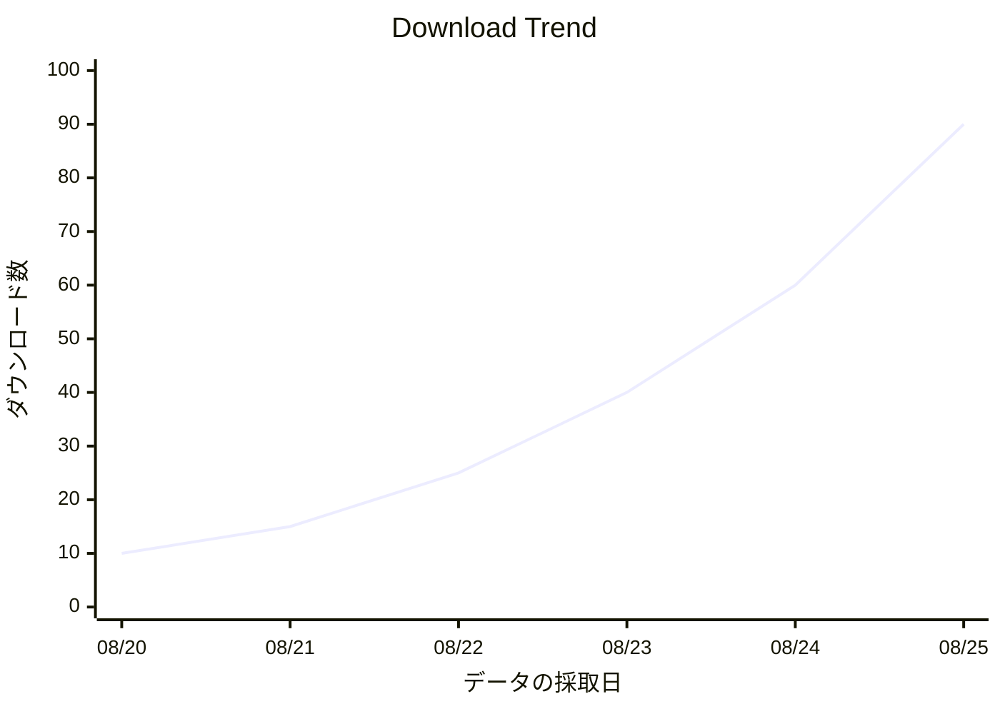

# S2J Package Dashboard - 統計/可視化の仕様

## 概要

本ドキュメントは、S2J Package Dashboard の初期設計における、統計/可視化を定義します。

Packagist/GitHub API の仕様変更、統計モデルの変更、可視化要件、iOS/iPadOS/Android 対応、Kotlin Multiplatform (KMP) 移行等に応じて更新する。

## 目的

本ドキュメントでは、統計の収集、集計、比較および可視化の意味を定義する。Packagist/GitHub 統計、Historical 傾向、Derived 指標、Comparison、Chart、鮮度と可用性を対象とする。

## 非目的

本仕様は、API Authentication フロー、クレデンシャル保存、データベース・エンジン、SwiftUI/Compose 実装、Chart Library 選択、External Server、User アカウント System を対象としない。

## 責務

指標の意味、収集方針、プロバイダ差、可視化の意味、スナップショットの粒度 (日次である理由) を正本とする。

## 非責務

統計の型とスキーマは [`models_spec.md`](./models_spec.md)、正しさのルールは [`domain_rules.md`](./domain_rules.md)、スナップショット永続は [`storage_spec.md`](./storage_spec.md)、キャッシュ方針は [`cache_spec.md`](./cache_spec.md)、画面の領域・構成は [`screen_spec.md`](./screen_spec.md)、到達可能性とサイズクラスは [`ui-viewport.md`](./ui-viewport.md)、Loading / Refresh / Freshness / Chart Textual Summary の見え方は [`ui.md`](./ui.md)、視覚 Token と数値書式は [`design_spec.md`](./design_spec.md)、状態分類は [`application_state.md`](./application_state.md)、API エンドポイントは各 API 仕様を正本とする。

## 基本方針

統計について、下記を基本原則とする。

1. ソースを明示する
2. 指標の意味を混同しない
3. Current Value と Historical Value を分離する
4. Raw データと Derived データを区別する
5. 取得不能と0を区別する
6. スナップショットを時系列データとして保持する
7. 外部 API の Retention 制限をアプリケーション側で補完する
8. 可視化は指標の意味を正確に表現する
9. 比較可能な指標だけを比較する
10. UI 上 でデータ鮮度を示す

## 統計ソース

初期バージョンでは下記を統計ソースとする。

* Packagist
* GitHub
* Derived

## Packagist 指標

初期バージョンで扱う Packagist 指標:

* ダウンロード数: Total / Monthly / Daily
* Favers
* Dependents
* Versions

Packagist パッケージ API ではパッケージ情報とともに ダウンロード統計等を取得できる。Stats API でもダウンロード統計と Faver Count 等を取得できる。([Packagist API](https://packagist.org/apidoc))

## Packagist ダウンロード数

ダウンロード数は Total / Monthly / Daily を区別する。数値のみを扱わず、期間を指標 ID の一部として扱う。

## Total ダウンロード数

Total ダウンロード数は、Packagist が提供する累計 Download 数を表す。

* source = Packagist
* name = ダウンロード数
* period = total
* value

アプリケーション側で独自に累計値を算出しない。

## Monthly ダウンロード数

Monthly ダウンロード数は、Packagist が提供する Monthly ダウンロード数を表す。

* source = Packagist
* name = ダウンロード数
* period = monthly
* value

「直近30日」と同義とは限らないため、UI で勝手に `Last 30 Days` と表記しない。

## Daily ダウンロード数

Daily ダウンロード数は、Packagist が提供する Daily ダウンロード数を表す。

Historical 傾向を作成する場合は、取得時点の Daily データをスナップショットとして保存する。

## Packagist Favers

Favers は Packagist 由来の指標として扱う。

* ソース = Packagist
* 指標 = favers

GitHub Stars とは別指標とする。

Packagist の Stats API では、Faver Count が GitHub stars と Packagist favorites を合わせた値として説明されているため、UI 上でも単純に GitHub Stars として表示しない。([Packagist API](https://packagist.org/apidoc))

## Dependents

Dependents Count を取得可能な場合に扱う。

* ソース = Packagist
* 指標 = dependents
* unit = count

取得できない場合は0としない。

## GitHub 指標

初期バージョンで扱う GitHub 指標:

* Stars
* Forks
* Open Issues
* Contributors
* Commit 履歴
* トラフィック (`## GitHub トラフィック`)

GitHub REST API はリポジトリ統計として Commit 履歴、Contributor Commit 履歴等を提供し、トラフィック API として Clones、Page Views、Referrers 等を提供する。([GitHub REST API](https://docs.github.com/ja/rest/metrics))

## GitHub Stars

Stars はリポジトリの Current 指標として扱う。

* ソース = GitHub
* 指標 = stars
* unit = count

Stars の Historical 傾向を表示する場合、アプリケーション側でスナップショットを蓄積する。

## GitHub Forks

Forks はリポジトリの Current 指標として扱う。

* ソース = GitHub
* 指標 = forks
* unit = count

## Open Issues

Open Issues Count を Current 指標として扱う。

* ソース = GitHub
* 指標 = openIssues
* unit = count

Issue の増減傾向を将来的に扱う場合は、スナップショットを利用する。

## Contributors

Contributors Count は、取得可能な場合に Current 指標として扱う。

* ソース = GitHub
* 指標 = contributors
* unit = count

Contributor の個人情報そのものを統計モデルに保存する必要はない。

## Commit 履歴

Commit 履歴は時系列の指標として扱う。

* period
* commits
* capturedAt

GitHub API が提供する Weekly Commit 履歴や Last Year の Commit 履歴を利用する。([GitHub REST API](https://docs.github.com/ja/rest/metrics))

## Commit 履歴 Retention

GitHub が長期間の Commit 履歴を提供する場合、そのデータをそのまま Historical スナップショットに複製する必要はない。

一方、アプリケーション側で独自の長期傾向を構築する必要がある指標については、スナップショットを保存する。

## GitHub トラフィック

GitHub トラフィックでは下記を扱う。

* Clones: Count / Uniques
* Views: Count / Uniques
* Referrers
* Popular コンテンツ

GitHub トラフィック API は Clones および Page Views について、Total と日次/週次 Breakdown を提供する。([リポジトリ トラフィック用 REST API エンドポイント - GitHubドキュメント](https://docs.github.com/ja/rest/metrics/traffic))

## トラフィック Retention

GitHub トラフィックは長期過去データの「信頼できる情報源 (SoT)」として使用しない。

GitHub が提供するトラフィック・データは直近14日間を対象とする。([Viewing traffic to a repository - GitHub Docs](https://docs.github.com/en/repositories/viewing-activity-and-data-for-your-repository/viewing-traffic-to-a-repository?apiVersion=2022-11-28))

したがって、14日を超える傾向は S2J 側スナップショットから組み立てる。組み立て HOW は [`api-github.md`](./api-github.md) の「長期統計」を正本とする。

## トラフィック Permission

取得に必要な権限は [`api-github.md`](./api-github.md) の `## Token スコープ` / `## エンドポイントの概要` を正本とする。本仕様は、取得不能を `NotAuthorized` とし `0` と扱わないことだけを定める。

## 統計スナップショット

Historical 統計はスナップショットとして保存する。型とスキーマは [`models_spec.md`](./models_spec.md)、不変条件は [`domain_rules.md`](./domain_rules.md)、永続化は [`storage_spec.md`](./storage_spec.md) を正本とする。本仕様では、日次である理由と収集・可視化上の意味のみを定義する。

## スナップショット Granularity

可視化と時系列比較の基本単位は日次とする。同一日の複数取得や欠測の扱いは [`domain_rules.md`](./domain_rules.md) を正本とする。

## 指標「可用性」

可用性の値と Zero の区別は [`domain_rules.md`](./domain_rules.md) を正本とする。可視化では Unavailable を0として描かない。

## Partial スナップショット

Packagist 取得には成功したが、GitHub 取得に失敗するケースを許容する。プロバイダ単位の可用性は [`domain_rules.md`](./domain_rules.md) を正本とする。可視化では取得できた側だけを描き、欠測側を0で埋めない。

## 鮮度

鮮度の状態 (Fresh / Stale / Expired / Unavailable) と TTL は [`cache_spec.md`](./cache_spec.md) を正本とする。本仕様は、鮮度判定が指標ごとに異なり得ることだけを定める。

## 鮮度の方針

Fetch 失敗時に既存キャッシュを Stale として使うことは [`cache_spec.md`](./cache_spec.md) を正本とする。古いデータを出すときの取得日時の表示は [`ui.md`](./ui.md) を正本とする。

## Current 統計

Current Value と Historical Value の分離は `## 基本方針` を正本とする。指標の意味は `## Packagist 指標` / `## GitHub 指標` を正本とする。パッケージ Detail 上の置き場所は [`screen_spec.md`](./screen_spec.md) を正本とする。

## 統計ダッシュボード

複数パッケージの主要指標を比較可能とする。画面上の置き場所は [`screen_spec.md`](./screen_spec.md) を正本とする。比較対象は `## パッケージ Comparison` を正本とする。

## パッケージ Comparison

比較可能な指標:

* ダウンロード数
* Stars
* Forks
* Favers
* Dependents

比較対象の指標は「同一の期間/単位」にそろえる。

例:

| パッケージ | ダウンロード数 | Stars | Forks |
| --- | --- | --- | --- |
| package-a | 120,000 | 2,400 | 180 |
| package-b | 80,000 | 3,100 | 240 |
| package-c | 45,000 | 1,200 | 90 |

## Ranking

Ranking を提供する場合、指標を明示する。

例:

* Top ダウンロード数
* Top GitHub Stars
* Top Forks
* Top Dependents

単に、「Popular パッケージ」と表示して指標をあいまいにしない。

## Ranking Direction

原則として、`Higher is Better` ではなく、`Descending Value` としてランキングする。

統計は必ずしも「大きいほど良い」とは限らないため、UI 上で Value Judgement を行わない。

## 傾向

傾向は、スナップショット間の Value 変化として定義する。

* 傾向: `Current Value - Previous Value`
* Percentage Change: `( (Current - Previous) / Previous) × 100`

ただし Previous Value が0の場合、Percentage Change を計算しない。

## 傾向「可用性」

傾向は最低2点のデータが必要。

1点では傾向なし。2点以上で傾向 Available。

## Growth Rate

Growth Rate を表示する場合、計算期間を明示する。

例:

* 7-day Growth
* 30-day Growth
* 90-day Growth

「Growth +12%」のように期間を省略しない。

## ダウンロード Growth

Packagist ダウンロード Growth については、スナップショットから計算する。

例:

* Current = 120,000
* Previous = 100,000
* Growth = +20%

## Moving Average

長期傾向を平滑化する場合、Moving Average を使用可能とする。

例:

* 7-day Moving Average
* 30-day Moving Average

Raw データと Derived データを同一 Series として扱わない。

## Moving Average Disclosure

Moving Average を表示する場合、UI 上で明示する。

* ダウンロード数: 30-day moving average

単純な「ダウンロード数」として表示しない。

## Normalization

異なるパッケージ間で指標を比較する場合、必要に応じて Normalization を行う。

例:

* ダウンロード数/日

ただし Normalized 指標は Raw 指標とは別指標として扱う。

## Rate 指標

Rate 指標には期間を含める。

* ダウンロード数/日
* Commits/週
* Stars/月

「Rate」の定義をあいまいにしない。

## Derived 指標

初期バージョンで検討する Derived 指標:

* ダウンロード Growth
* Star Growth
* Fork Growth
* ダウンロード per Day
* ダウンロード/Star
* リリース Frequency
* Commit Frequency

ただし、初期バージョンでは必要最小限にする。

## ダウンロード/Star Ratio

ダウンロード/Star Ratio を表示する場合、Packagist ダウンロード数/GitHub Stars として定義する。

これは Popularity そのものではない。

UI では、`ダウンロード数/Star` 等、意味が明確な名称を使用する。

## リリース Frequency

リリース Frequency を導入する場合、対象期間を明示する。

例:

* `リリース/90 days`

Dev バージョン等を含めるかどうかを明確に定義する。

## Commit Frequency

Commit Frequency を導入する場合、期間と対象 Branch を明示する。

例:

* `Commits/week`

GitHub API の Commit 履歴の意味を独自指標に変換する場合は、ソースと計算ルールを記録する。

## 可視化 Principle

可視化では、「見栄え」より「指標の意味の正確な表現」を優先する。

データから Semantic Meaning を経て可視化する。

## Chart Types

初期バージョンでは下記を使用する。

* Line Chart
* Bar Chart
* Area Chart

必要性が確認されるまで、Pie Chart 等は積極的に使用しない。

## Line Chart

Time Series には Line Chart を使用する。

適用例:

* Daily ダウンロード数
* GitHub Stars
* GitHub Views
* GitHub Clones
* Commits

## Bar Chart

カテゴリー比較には Bar Chart を使用する。

適用例:

* パッケージ・ダウンロード数
* パッケージ Stars
* パッケージ Forks

## Area Chart

累積または Volume の変化を強調する必要がある場合に使用する。

ただし、複数指標の重なりによって値が読みにくくならないようにする。

## Dual Axis

異なる単位を持つ指標を、原則として同一 Chart の Dual Axis に配置しない。

たとえば、

* ダウンロード数
* GitHub Stars

を同一 Y 軸に混在させない。

必要な場合は別 Chart とする。

## Multi-series Chart

複数 Series を表示する場合、下記を同一 Chart に配置する。

* 同一の単位
* 同一の期間
* 同一の Semantic

例:

* GitHub Views
* GitHub Unique Views

## 指標 Comparison

異なる指標を比較したい場合、必要に応じて Normalized Value を使用する。

例:

* Relative Growth

ただし Raw Value を隠さない。

## Chart Time Range

選択 UI の Period は [`screen_spec.md`](./screen_spec.md) を正本とする。本仕様は、実際にデータが存在する期間だけを表示することだけを定める。

## Insufficient 履歴

十分な Data Point がない場合のドメイン状態は [`domain_rules.md`](./domain_rules.md) を正本とする。表示文言は [`ui.md`](./ui.md) を正本とする。本仕様は、不足期間を0で埋めないことだけを定める。

## Gap Handling

スナップショットが存在しない期間は、原則として Chart 上で Gap として扱う。欠測を `0` にしないこと、ドメイン上で補間しないことは [`domain_rules.md`](./domain_rules.md) を正本とする。

```text
●──●     ●──●
      gap
```

## Interpolation

Historical Data を自動 Interpolation しないことは [`domain_rules.md`](./domain_rules.md) を正本とする。本仕様は、補間する場合だけ Derived 指標として明示することだけを定める。

## Outlier

Outlier を自動的に削除しない。

たとえば、

```mermaid
xychart-beta
    title "Downloads"
    x-axis "データの採取日" [1, 2, 3, 4, 5, 6, 7]
    y-axis "ダウンロード数" 0 --> 100
    line [10, 10, 10, 10, 10, 10, 90]
```

のような急増も Raw データとして保持する。

## リリース Correlation

将来的にリリースと統計を同一 Chart に Overlay 可能とする。

例:


**イベント:** `2026-08-23 — v3.0 リリース`

リリース・イベントは統計そのものとは別エンティティとして扱う。

**コメント**: 今回の StatisticsSnapshot → ChartPoint という設計を考えると、`ChartPoint(timestamp, value, label?)` の `label` をイベント表示に利用する設計はかなり自然です。

## 注釈

Chart には必要に応じてイベント注釈を表示する。

例:

* v3.0.0 - リリース
* セキュリティ告知 Published
* リポジトリ Archived

注釈のデータソースを明示する。

## Chart Interaction

画面上のジェスチャは [`screen_spec.md`](./screen_spec.md) を正本とする。本仕様は、選択したデータ Point が Date / Value / ソースを開示することだけを定める。

## アクセシビリティ

色だけで伝えないことは [`ui.md`](./ui.md) を正本とする。本仕様は、可視化で Line Style / Symbol / Label を併用し得ることだけを定める。

## Color Usage

Chart Color の Token は [`design_spec.md`](./design_spec.md) を正本とする。本仕様は、同一指標を画面跨ぎでも同じ Visual Encoding にすることだけを定める。

## ダークモード

ライト/ダークの視覚は [`design_spec.md`](./design_spec.md) を正本とする。本仕様は、Chart が両モードで指標を読み取れることだけを定める。

## iPhone Layout

画面の領域・構成は [`screen_spec.md`](./screen_spec.md)、サイズクラスは [`ui-viewport.md`](./ui-viewport.md) を正本とする。本仕様は、iPhone では主要指標を縦方向に置き、Chart を無理に横長にしないことだけを定める。

## iPad Layout

画面の領域・構成は [`screen_spec.md`](./screen_spec.md) を正本とする。本仕様は、iPad では Horizontal Space を活用してキー指標と Chart を並列し得ることだけを定める。

## Landscape

向き変更時の Layout/到達可能性は [`ui-viewport.md`](./ui-viewport.md) を正本とする。本仕様は、統計 Chart が向き変更後も指標の意味の保持だけを定める。

## Chart の画面外操作

Chart / ダッシュボードの到達可能性とオーバーフロー禁止は [`ui-viewport.md`](./ui-viewport.md) を正本とする。本仕様は、重要な指標や Chart 操作が画面外に残らないことだけを定める。

## 水平スクロール

水平スクロールの可否と到達可能性は [`ui-viewport.md`](./ui-viewport.md) を正本とする。本仕様は、Chart / ダッシュボード Card / 指標グリッドを無目的に水平スクロール Container に入れないことだけを定める。

## 操作領域

Interactive Control の最小サイズは [`ui.md`](./ui.md)、到達可能性は [`ui-viewport.md`](./ui-viewport.md) を正本とする。本仕様は、小さなデータ Point でも Touch Area を拡張することだけを定める。

## Current vs Historical

UI では、`Current` と `Historical` を明確に区別する。

例:

* ダウンロード数: 120,000
* 30-day 傾向: [Chart]

## データソース Display

統計 Card/Chart にソースを出すことは本仕様の可視化方針とする。表示文言は [`ui.md`](./ui.md) を正本とする。

## データ鮮度 Display

Stale を Fresh に見せないことは [`cache_spec.md`](./cache_spec.md)、表示文言は [`ui.md`](./ui.md) を正本とする。本仕様は、統計 Card で Stale を隠さないことだけを定める。

## Permission 状態 Display

権限不足の表示は [`authentication_spec.md`](./authentication_spec.md) / [`ui.md`](./ui.md) を正本とする。本仕様は、トラフィック等を `0` にしないことだけを定める。

## エラー状態

Partial Failure の見え方は [`ui.md`](./ui.md) を正本とする。本仕様は、統計取得エラーでダッシュボード全体を落とさないことだけを定める。

## Loading 状態

既存データがある Refresh の見え方は [`ui.md`](./ui.md) を正本とする。本仕様は、統計 Card を毎回全面スケルトンに置換しないことだけを定める。

## Refresh 方針

手動更新の UI は [`ui.md`](./ui.md) / [`screen_spec.md`](./screen_spec.md) を正本とする。本仕様は、Refresh を Manual / Automatic / Background に区別し、初期バージョンでは手動更新を基本とすることだけを定める。

## Automatic Refresh

Automatic Refresh を導入する場合、API レート制限と Battery Consumption を考慮する。

不要な高頻度 Polling を行わない。

## Background スナップショット

Background スナップショットを将来実装する場合、Scheduled Background Task で統計を Fetch し、スナップショットを Store する。

Background Task が失敗しても、既存過去データを破壊しない。

## スナップショット Retention

Historical スナップショットは、長期傾向を目的として保存する。削除期限、Quota、集約の永続は [`storage_spec.md`](./storage_spec.md) を正本とする。

## ストレージ最適化

長期間のスナップショット増加時の集約永続は [`storage_spec.md`](./storage_spec.md) を正本とする。本仕様は、元データを削除する場合に Loss of Precision を指標の意味として明示することだけを定める。

## 集約

集約する場合、指標ごとに適切な集約ルールを使用する。

例:

* ダウンロード数 → Sum
* Stars → Last Value
* Forks → Last Value
* Views → Sum
* Unique Views → Do not blindly Sum

特に Unique 指標は、単純加算が意味を持たない場合がある。

## 集約メタデータ

集約日付には、

* 集約 = sum
* 集約 = average
* 集約 = last

等のルールを識別可能とする。

## 期間境界

期間集計では、UTC を基本境界とする。

プロバイダ API が別の Time Zone を使用する場合、プロバイダの Definition を優先する。

## Packagist/GitHub Time Zone

Packagist/GitHub それぞれのタイムスタンプ Definition を尊重する。

GitHub トラフィックではタイムスタンプが UTC midnight に Alignment される。([リポジトリ トラフィック用 REST API エンドポイント - GitHubドキュメント](https://docs.github.com/ja/rest/metrics/traffic))

アプリケーション側で現地時間に変換するのはプレゼンテーション層とする。

## Comparison 期間

パッケージ比較では、同一期間を使用する。

* パッケージ A: `30 days`
* パッケージ B: `30 days`

を比較し、

* パッケージ A: `30 days`
* パッケージ B: `90 days`

を直接比較しない。

## Ranking データ鮮度

Ranking では、異なる時点のデータを混在させない。

可能な限り、same `capturedAt` または同等の鮮度 Window を使用する。

## Missing パッケージ

パッケージが取得不能になった場合、Historical 統計を削除しない。

## Archived リポジトリ

GitHub リポジトリ が Archived になった場合も、Historical 統計を保持する。

Current 状態として、`Archived` を表示可能とする。

## Deleted リポジトリ

リポジトリが Deleted/unavailable となった場合、GitHub 統計を新規取得できなくなる。

ただし、「Existing スナップショット」は Retention 方針に従って保持する。

## 指標の信頼できる情報源 (SoT)

| 指標 | ソース |
| --- | --- |
| パッケージ・ダウンロード数 | Packagist |
| Packagist Favers | Packagist |
| Dependents | Packagist |
| パッケージ・バージョン | Packagist |
| GitHub Stars | GitHub |
| GitHub Forks | GitHub |
| Open Issues | GitHub |
| Contributors | GitHub |
| Commit 履歴 | GitHub |
| リポジトリ Clones | GitHub |
| リポジトリ Views | GitHub |
| Derived Growth | S2J Package Dashboard |

## 指標 Naming

指標 Name はプロバイダ固有名称とドメイン上の意味を混同しない。

たとえば、「Packagist Favers」と「GitHub Stars」を、「Favorites」という一つの指標に統合しない。

## 単位

各指標には単位を定義する。

例:

* Count
* Percentage
* Rate
* Duration

単位を伴う視覚書式 (`2,478 downloads` 等) は [`design_spec.md`](./design_spec.md) を正本とする。

## 指標 Definition

指標の型とフィールドは [`models_spec.md`](./models_spec.md) を正本とする。本仕様は、source / name / value / unit / period / capturedAt / availability を指標の意味として欠かせないことだけを定める。

## Raw 指標

Raw 指標は、プロバイダから直接取得した Value を表す。由来の型は [`models_spec.md`](./models_spec.md) を正本とする。

## Derived 指標

Derived 指標は、アプリケーション側で計算した Value を表す。由来 `Calculated` は [`models_spec.md`](./models_spec.md) を正本とする。本仕様は、計算ルールを追跡可能とすることだけを定める。

## 計算バージョン

Derived の計算ルール変更は追跡する。永続フィールドは [`models_spec.md`](./models_spec.md) / [`storage_spec.md`](./storage_spec.md) を正本とする。

## 統計スキーマ・バージョン

永続スキーマの version は [`storage_spec.md`](./storage_spec.md) / [`models_spec.md`](./models_spec.md) を正本とする。本仕様は、API バージョンと混同しないことだけを定める。

## 可視化 モデル

ドメイン統計をそのまま UI に渡さないことは [`architecture.md`](./architecture.md) を正本とする。本仕様は、Chart 向けにタイムスタンプ/value/label へ写すことだけを定める。

## Chart データ

Chart データは UI 向け構造とする。ドメイン・モデルとプレゼンテーション・モデルの分離は [`architecture.md`](./architecture.md) を正本とする。

## Chart 状態

Chart の UI 状態分類は [`ui.md`](./ui.md) / [`application_state.md`](./application_state.md) を正本とする。本仕様は、それらをドメイン統計モデルに含めないことだけを定める。

## Chart アクセシビリティ

Textual Summary の提供は [`ui.md`](./ui.md) を正本とする。本仕様は、Summary が指標の意味を変えず、Derived を公式値として見せないことだけを定める。

## Large Numbers

Compact 表示の見た目は [`design_spec.md`](./design_spec.md) を正本とする。本仕様は、Compact にしても詳細 Value を確認できることだけを定める。

## Precision

Count は原則として整数。Percentage の桁は指標ごとに定義する。Compact / ロケール書式は [`design_spec.md`](./design_spec.md) を正本とする。本仕様は、Count を小数に見せないこと、Percentage の必要な Precision を指標定義として持つことだけを定める。

## Negative Value

Count の非負は [`domain_rules.md`](./domain_rules.md) を正本とする。本仕様は、Derived Difference が正負を取り得ることだけを定める。

## Percentage Change

Percentage Change は、`(Current - Previous) / Previous × 100` とする。

Previous = 0の場合: `Unavailable` とする。

## 傾向 Direction

Trend のドメイン状態は [`domain_rules.md`](./domain_rules.md) を正本とする。本仕様は、可視化で Up / Down / Flat / Unavailable として示すことだけを定める。

## Flat 傾向

Stable 判定の Threshold は [`domain_rules.md`](./domain_rules.md) を正本とする。本仕様は、Threshold なしで「変化なし」と見せないことだけを定める。

## Correlation

複数指標間の Correlation を将来的に提供可能とする。

例:

* 「GitHub Stars vs Packagist ダウンロード数」

ただし Correlation を Causation として表示しない。

## No Causal Claim

統計可視化は、因果関係を自動的に主張しない。

たとえば、

* ダウンロード数 ↑
* Stars ↑

から、`Stars caused ダウンロード数 increase` とは判断しない。

## Comparison Limit

初期バージョンでは、一度に比較するパッケージ数を UI が読める範囲に制限する。

特に Mobile では、過剰な Multi-series Chart を避ける。

## パッケージ・ダッシュボード Priority

画面上の表示の優先順位は [`screen_spec.md`](./screen_spec.md) を正本とする。本仕様は、何をキー指標とするかだけを定義する。

## キー指標

初期バージョンのキー指標候補:

* Packagist ダウンロード数
* Packagist Favers
* GitHub Stars
* GitHub Forks

リポジトリが存在する場合のみ GitHub 指標を表示する。

## 統計スクリーン

画面の領域、構成、Layout は [`screen_spec.md`](./screen_spec.md) を正本とする。本仕様は、そこに載せる指標の意味だけを定義する。

## 統計 Refresh Scope

Refresh 操作には Scope を持たせる。

* Refresh パッケージ
* Refresh ダッシュボード
* Refresh All

初期バージョンでは、ユーザーが意図しない大量 API Request を発生させない。

## レート制限 Awareness

API レート制限を考慮する。

Request はキャッシュを先に見る。Existing なら Reuse、なければ API。キャッシュ方針は [`cache_spec.md`](./cache_spec.md) を正本とする。

不要な Repeated Request を避ける。

## キャッシュ Interaction

統計取得では、キャッシュが Fresh なら Use、でなければ Fetch を基本とする。

キャッシュ方針は [`cache_spec.md`](./cache_spec.md) で定義する。スナップショットの永続化は [`storage_spec.md`](./storage_spec.md) を正本とする。

## スナップショット Interaction

キャッシュとスナップショットの区別は [`cache_spec.md`](./cache_spec.md) / [`storage_spec.md`](./storage_spec.md) を正本とする。Historical の不変条件は [`domain_rules.md`](./domain_rules.md) を正本とする。

## Historical Correction

既存スナップショットを書き換えない不変条件は [`domain_rules.md`](./domain_rules.md) を正本とする。本節は Correction レコードの扱いだけを定義する。

プロバイダが過去データを修正した場合でも、既存スナップショットを無条件に上書きしない。

必要な場合、

* originalValue
* correctedValue
* correctedAt
* reason

を利用可能とする。

## 統計 Export

将来的に統計 Export を提供する場合、下記を候補とする。

* CSV
* JSON

Export 対象:

* Raw スナップショット
* Derived 指標
* メタデータ

クレデンシャル (資格情報) は含めない。

## データ所有権

統計スナップショットは、S2J Package Dashboard が取得した Historical レコードである。

プロバイダ側の Official Historical データベースそのものではない。

UI では必要に応じて、`Collected by S2J Package Dashboard` 等の意味を明示する。

## 長期傾向 Limitation

長期傾向の開始日は、アプリケーションが最初にスナップショットを取得した日となる。

Install → First スナップショット → 履歴 Begins。

過去データが取得できない指標について、インストール前の履歴を推測しない。

## 統計「可用性」

扱う指標は `## Packagist 指標` / `## GitHub 指標` を正本とする。本仕様は、パッケージごとに利用可能な指標だけを表示し、トラフィックは `## トラフィック Permission` に従うことだけを定める。

## プロバイダ Failure

* Packagist Failure: `Packagist unavailable`
* GitHub Failure: `GitHub unavailable`

としてプロバイダ単位で表示する。

## オフライン Mode

オフライン時には、ローカル・キャッシュ/スナップショットが存在する場合、それを表示可能とする。

鮮度を明示する。

## オフライン統計

オフライン・データには、`Last updated` を表示可能とする。

Online データと誤認させない。

## セキュリティ

統計データには、クレデンシャル (資格情報) を含めない。

認可済み API 応答から取得したデータについても、必要な統計のみを永続化に保存する。

詳細は [`security_spec.md`](./security_spec.md) を参照する。

## Privacy

統計コレクションでは、不要な個人情報を保存しない。

たとえば GitHub トラフィックの統計取得に必要だからといって、Visitor 個人を識別する情報をアプリケーションに保存しない。

## API Authentication

統計取得に Authentication が必要な場合は、[`authentication_spec.md`](./authentication_spec.md) に従う。

統計仕様では、`Authentication Required` という Capability だけを扱う。

## テスト

統計について最低限、下記をテストする。

* 指標マッピング
* スナップショット Creation
* スナップショット Deduplication
* 集約
* 傾向の計算
* Percentage Change
* Missing データ
* Unavailable データ
* Partial プロバイダ Failure
* キャッシュ Interaction
* Time Zone
* Chart マッピング

## 計算テスト

下記をテストする。

```text
Previous = 100
Current = 120
→ +20%

Previous = 100
Current = 80
→ -20%

Previous = 0
Current = 100
→ Unavailable
```

## Time Series テスト

下記をテストする。

* Continuous データ
* Missing Day
* Duplicate Day
* Out-of-order スナップショット
* Timezone 境界
* Leap Day
* Year 境界

## 可視化テスト

向き / デバイス / 長い Name の Layout 確認は [`ui-viewport.md`](./ui-viewport.md) を正本とする。本節は、指標の意味が破綻しないことだけをテストする。

* Small Value
* Large Value
* Zero
* Negative Delta
* Missing データ
* Unavailable データ
* Many パッケージ
* ダークモード
* ライトモード

## Viewport テスト

Viewport の確認項目は [`ui-viewport.md`](./ui-viewport.md) の Test Matrix / Acceptance Criteria を正本とする。本仕様のテストでは、指標の可読性と Chart 操作が破綻しないことだけを確認する。

## Initial Layout

向き変更時の Intermediate Layout 禁止は [`ui-viewport.md`](./ui-viewport.md) を正本とする。

## アクセシビリティ

統計 UI は、Dynamic Type/Font Scaling に対応可能な設計とする。大きい Text で重要指標が Clipped しないことは [`ui-viewport.md`](./ui-viewport.md) を正本とする。

## 翻訳

指標 Label は翻訳対象とする。

たとえば:

* ダウンロード数
* Stars
* Forks
* Views
* Clones

を Hard-coded String としてドメイン・モデルに埋め込まない。

## Unit 翻訳

Number Format はロケールに応じて変更可能とする。

ただし指標 Value そのものはロケール非依存な数値として保持する。

## Chart 翻訳

Chart Axis/Tooltip/Legend も翻訳対象とする。

Date Format は User ロケールに応じて表示する。

## データモデル・リファレンス

統計の型と関係は [`models_spec.md`](./models_spec.md) を正本とする。

## アーキテクチャー・リファレンス

層の置き場所と DTO → ドメインは [`architecture.md`](./architecture.md) / [`models_spec.md`](./models_spec.md)、永続化は [`storage_spec.md`](./storage_spec.md) を正本とする。本仕様は統計の意味と可視化だけを定める。

## ドメイン境界

統計ドメイン・モデルは、Chart フレームワーク (Swift Charts / Compose Chart 等) に依存しない。

## プラットフォーム UI

Native UI は [`architecture.md`](./architecture.md) を正本とする。本仕様は、Chart Rendering をプラットフォーム UI に委譲することだけを定める。

## 可視化アダプタ

必要に応じて、`StatisticsChartMapper` を設ける。ドメイン統計 → Chart モデルの層境界は [`architecture.md`](./architecture.md) / [`models_spec.md`](./models_spec.md) を正本とする。

## Initial バージョン Scope

v1で扱う指標は `## Packagist 指標` / `## GitHub 指標` を正本とする。トラフィックの取得条件は `## トラフィック Permission` を正本とする。

## v1 - Historical Scope

過去データの粒度は `## スナップショット Granularity` を正本とする。GitHub トラフィックの14日 Window を超える組み立ては [`api-github.md`](./api-github.md) の「長期統計」を正本とする。本仕様は、v1の過去データの基本単位を Daily スナップショットとすることだけを定める。

## v1 - 可視化 Scope

画面の領域・構成は [`screen_spec.md`](./screen_spec.md) を正本とする。本仕様は、v1でリストにキー指標、Detail に Current / Historical、ダッシュボードに Comparison を載せる意味だけを定める。

## v1 - Chart Scope

使用する Chart 種別は `## Chart Types` を正本とする。本仕様は、複雑な可視化を User Need 確認後に追加することだけを定める。

## Future Scope

統計/可視化の将来候補:

* セキュリティ告知の傾向
* リリース注釈
* Advanced Correlation
* Custom ダッシュボード
* Custom 指標
* Cross-package Benchmark

Export は [`use_cases.md`](./use_cases.md)、Background スナップショットとクラウド同期は [`storage_spec.md`](./storage_spec.md) を正本とする。
